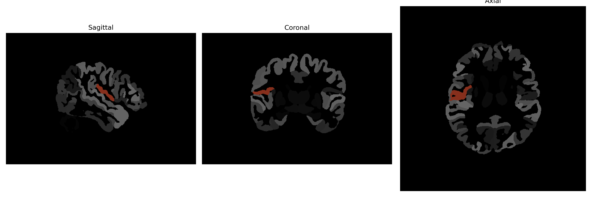

# central-operculum

## Overview

The Right central-operculum is a region in the human brain involved in various functional roles related to sensory and motor processing. It is part of the operculum, which covers over the insular cortex and is associated with functions like language, perception, and visceromotor roles. Located within the lateral sulcus, this area integrates information between sensory modalities and supports the coordination of complex movements and potentially plays a role in procedural memory. Its relationship to surrounding structures, such as the insula and the frontal and parietal lobes, underscores its involvement in complex aspects of connectivity within the brain's architecture.

There is no direct Wikipedia link specifically for the Right central-operculum; however, more information can be found in the article about the operculum: https://en.wikipedia.org/wiki/Operculum_(brain)

*Overview generated by GPT-4o (2026).*

---

**Region ID:** 34  
**Hemisphere:** Right  
**Atlas:** brainCOLOR 

---

## Full Brain – Black Background

**Full Quality Version:** [Download MP4](full_black.mp4)

---

## Full Brain – White Background

**Full Quality Version:** [Download MP4](full_white.mp4)

---

## Hemisphere Only – Black Background

**Full Quality Version:** [Download MP4](hemi_black.mp4)

---

## Hemisphere Only – White Background

**Full Quality Version:** [Download MP4](hemi_white.mp4)

---

## Triplanar View (Centered on ROI)

