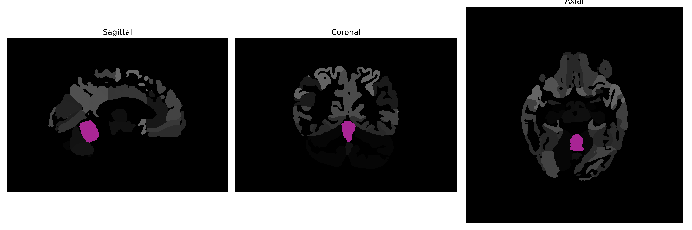

# Cerebellar-Vermal-Lobules-I-V

## Overview

The Midline Cerebellar-Vermal-Lobules-I-V are subsets of the cerebellum, specifically involving the anterior sections of the vermis. These lobules are involved in maintaining balance and controlling smooth, coordinated physical movements. The cerebellum itself is crucial for processing sensory input and coordinating motor function, and the vermal lobules contribute significantly by processing and integrating information from the vestibular system and proprioceptive inputs from the body to help maintain posture and locomotion equilibrium. The smooth surface anatomy of the cerebellum in these lobules underscores the fine-tuned nature of their function.

There is no direct Wikipedia link to a description of the Midline Cerebellar-Vermal-Lobules-I-V from the brainCOLOR Atlas. However, information about the cerebellum, which comprises these lobules, can be found at: [https://en.wikipedia.org/wiki/Cerebellum](https://en.wikipedia.org/wiki/Cerebellum).

*Overview generated by GPT-4o (2026).*

---

**Region ID:** 19  
**Hemisphere:** Midline  
**Atlas:** brainCOLOR 

---

## Full Brain – Black Background

**Full Quality Version:** [Download MP4](full_black.mp4)

---

## Full Brain – White Background

**Full Quality Version:** [Download MP4](full_white.mp4)

---

## Triplanar View (Centered on ROI)

