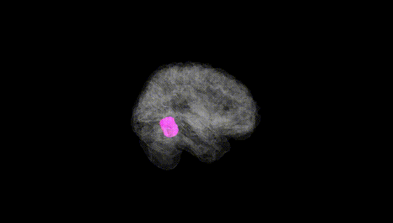
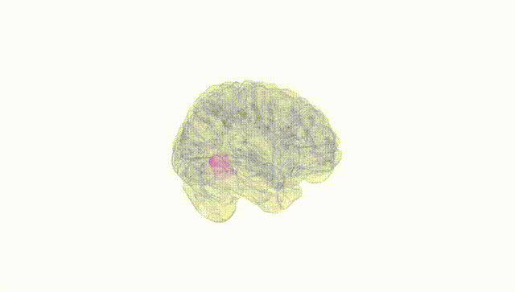
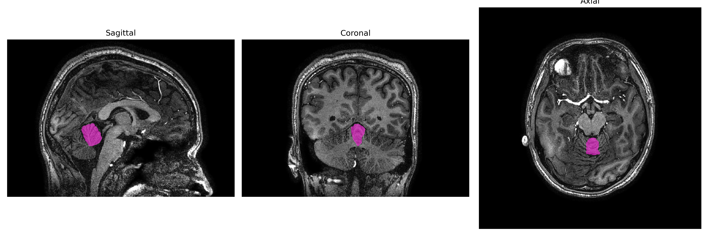
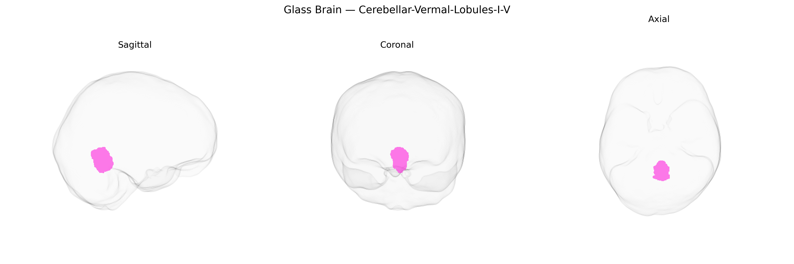

# Cerebellar-Vermal-Lobules-I-V

## Overview

The Midline Cerebellar Vermal Lobules I–V comprise the anterior superior portion of the cerebellar vermis, corresponding to the most rostral lobules of the classic cerebellar lobular scheme. These lobules are primarily involved in the regulation of axial and proximal limb musculature, postural control, and coordination of simple, stereotyped motor behaviors, integrating somatosensory and vestibular inputs to fine-tune motor output. Cytoarchitectonically, they are composed of the typical trilaminar cerebellar cortex (molecular layer, Purkinje cell layer, and granular layer) and are interconnected with fastigial and other deep cerebellar nuclei via Purkinje cell projections, participating in spinocerebellar and vestibulocerebellar circuits. Functionally, activity in these lobules is associated with balance, stance, and gait, and lesions or developmental abnormalities in this region can result in truncal ataxia, gait disturbances, and impaired coordination of midline body segments. There is no direct Wikipedia link to “Midline Cerebellar-Vermal-Lobules-I-V”; a closely related structure is the cerebellar vermis: https://en.wikipedia.org/wiki/Cerebellar_vermis.

*Overview generated by GPT-4o (2026).*

---

**Region ID:** 19  
**Hemisphere:** Midline  
**Atlas:** brainCOLOR 

---

## Cerebellar-Vermal-Lobules-I-V – Black Background (Full Brain)

**Full Quality Version:** [Download MP4](full_black.mp4)

---

## Cerebellar-Vermal-Lobules-I-V – White Background (Full Brain)

**Full Quality Version:** [Download MP4](full_white.mp4)

---

## Triplanar View – T1 Background

---

## Triplanar View – Ghost Brain


