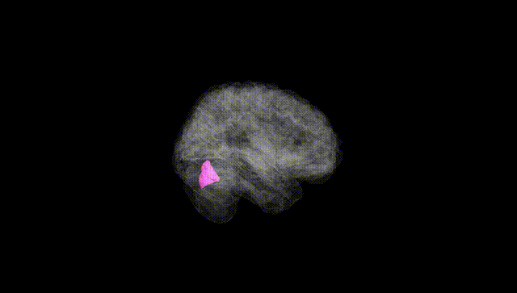
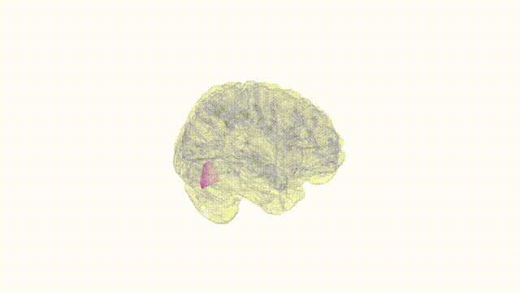
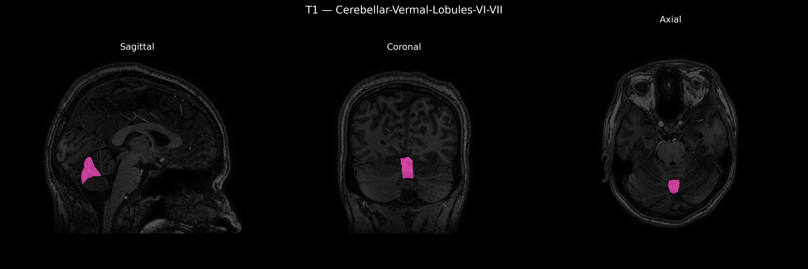
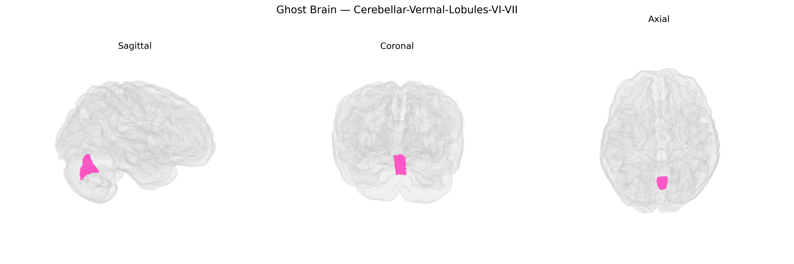

# Cerebellar-Vermal-Lobules-VI-VII

## Overview

The Midline Cerebellar-Vermal-Lobules-VI-VII region corresponds to the midline portion of cerebellar vermis encompassing lobules VI and VII, which are part of the posterior lobe of the cerebellum. These lobules are involved in higher-order motor coordination, posture, and balance, and are also implicated in cognitive and affective processing through extensive connections with the cerebral cortex, brainstem, and limbic structures. Vermal lobule VI (part of the superior posterior vermis) participates in the fine-tuning of voluntary movements and oculomotor control, whereas vermal lobule VII (including the declive and folium of the vermis in some classifications) is associated with cognitive, emotional, and autonomic modulation. This region is frequently studied in structural and functional neuroimaging due to its role in cerebellar contributions to motor and non-motor behavior and its involvement in neurodevelopmental, psychiatric, and neurodegenerative disorders.

There is no direct Wikipedia page for “Midline Cerebellar-Vermal-Lobules-VI-VII”; a closely related structure is the cerebellar vermis: https://en.wikipedia.org/wiki/Cerebellar_vermis

*Overview generated by GPT-4o (2026).*

---

**Region ID:** 20  
**Hemisphere:** Midline  
**Atlas:** brainCOLOR 

---

## Full Brain – Black Background

**Full Quality Version:** [Download MP4](full_black.mp4)

---

## Full Brain – White Background

**Full Quality Version:** [Download MP4](full_white.mp4)

---

## Triplanar View – T1 Background

---

## Triplanar View – Ghost Brain


