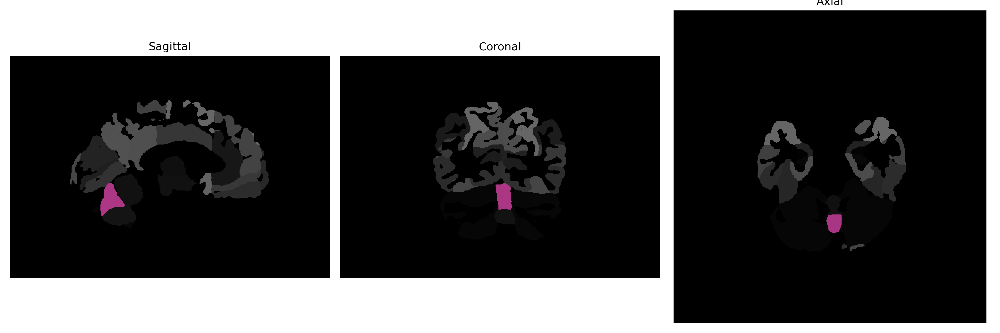

# Cerebellar-Vermal-Lobules-VI-VII

## Overview

The Midline Cerebellar-Vermal-Lobules-VI-VII region is located in the cerebellum, a major feature of the hindbrain responsible for motor control and coordination. These specific lobules, Lobules VI and VII, are part of the vermis, the midline section of the cerebellum. The vermis plays a crucial role in maintaining posture, balance, and fine-tuning motor movements. Lobules VI and VII are situated just anterior to the primary fissure dividing the cerebellum into the anterior and the posterior lobes and are associated with the processing of proprioceptive and sensory information necessary for the efficient execution of movement.

There is no direct Wikipedia link for Midline Cerebellar-Vermal-Lobules-VI-VII, but a related structure is the cerebellar vermis. Here is a link to the Wikipedia page: [Cerebellar vermis](https://en.wikipedia.org/wiki/Cerebellar_vermis).

*Overview generated by GPT-4o (2026).*

---

**Region ID:** 20  
**Hemisphere:** Midline  
**Atlas:** brainCOLOR 

---

## Full Brain – Black Background

**Full Quality Version:** [Download MP4](full_black.mp4)

---

## Full Brain – White Background

**Full Quality Version:** [Download MP4](full_white.mp4)

---

## Triplanar View (Centered on ROI)

