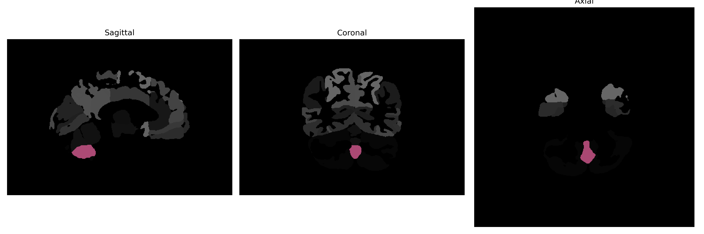

# Cerebellar-Vermal-Lobules-VIII-X

## Overview

The Midline Cerebellar-Vermal-Lobules-VIII-X region of the cerebellum is a critical area involved in coordinating fine motor control, balance, and posture. Located within the vermis, this region encompasses lobules VIII, IX, and X, which contribute to the modulation of vestibular and proprioceptive input. These lobules are integral to the cerebellar processing that ensures smooth execution of movements and stability during locomotion. Additionally, this area is involved in integrating sensory information for maintaining spatial orientation. The unique anatomical features and connectivity of the Midline Cerebellar-Vermal-Lobules-VIII-X highlight its significance in cerebellar function and its role in neural circuits governing motor activities.

There is no direct Wikipedia link for this specific region. However, a related Wikipedia page can be found on the cerebellum: [https://en.wikipedia.org/wiki/Cerebellum](https://en.wikipedia.org/wiki/Cerebellum).

*Overview generated by GPT-4o (2026).*

---

**Region ID:** 21  
**Hemisphere:** Midline  
**Atlas:** brainCOLOR 

---

## Full Brain – Black Background

**Full Quality Version:** [Download MP4](full_black.mp4)

---

## Full Brain – White Background

**Full Quality Version:** [Download MP4](full_white.mp4)

---

## Triplanar View (Centered on ROI)

