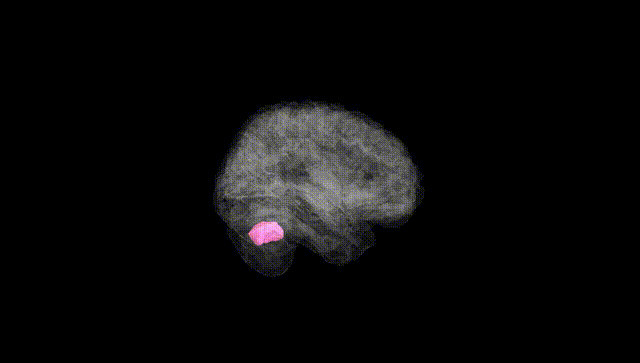
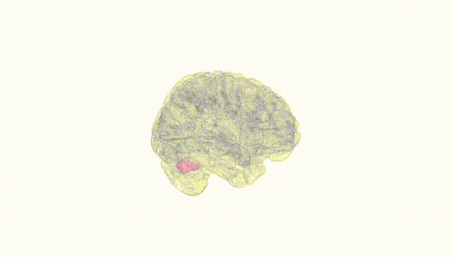
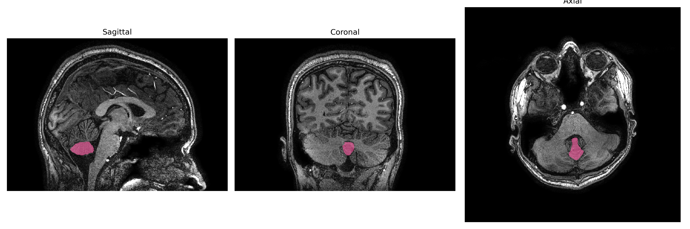
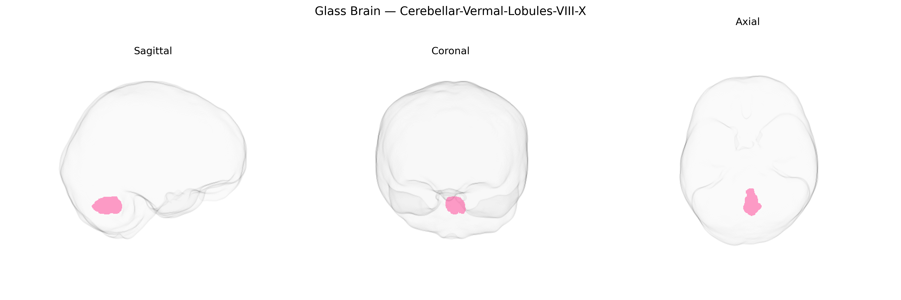

# Cerebellar-Vermal-Lobules-VIII-X

## Overview

The Midline Cerebellar-Vermal-Lobules-VIII–X region corresponds to the vermal portions of the posterior-inferior cerebellar lobules VIII, IX, and X, located along the midline of the cerebellum. These vermal lobules participate in the integration of vestibular, proprioceptive, and somatosensory inputs that contribute to balance, postural control, and coordination of axial and proximal limb movements. Lobule VIII is involved in sensorimotor processing and fine-tuning of ongoing motor activity, lobule IX is associated with vestibulocerebellar functions and spatial orientation, and lobule X (the nodulus) forms part of the flocculonodular lobe, critically engaged in vestibular reflexes and eye–head coordination. Collectively, these midline vermal regions play key roles in motor coordination, equilibrium, and the adaptive calibration of posture and gait.

There is no direct Wikipedia link for “Midline Cerebellar-Vermal-Lobules-VIII-X”; a closely related structure is the cerebellar vermis:  
https://en.wikipedia.org/wiki/Cerebellar_vermis

*Overview generated by GPT-4o (2026).*

---

**Region ID:** 21  
**Hemisphere:** Midline  
**Atlas:** brainCOLOR 

---

## Cerebellar-Vermal-Lobules-VIII-X – Black Background (Full Brain)

**Full Quality Version:** [Download MP4](full_black.mp4)

---

## Cerebellar-Vermal-Lobules-VIII-X – White Background (Full Brain)

**Full Quality Version:** [Download MP4](full_white.mp4)

---

## Triplanar View – T1 Background

---

## Triplanar View – Ghost Brain


