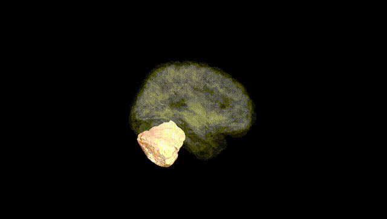
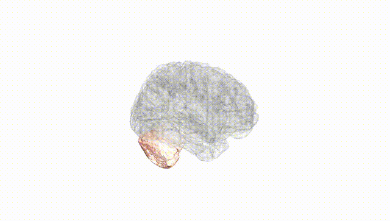
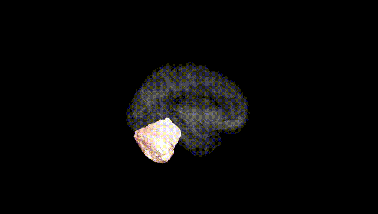
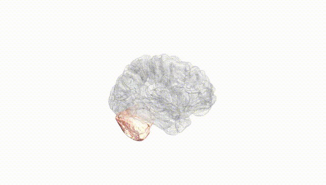
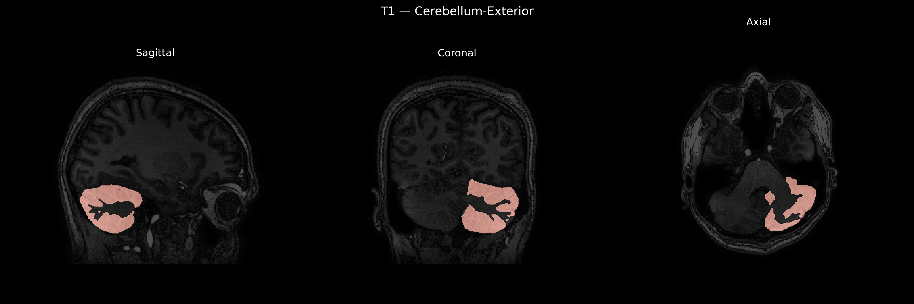
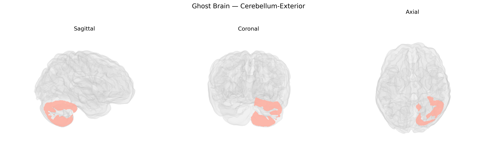

# Cerebellum-Exterior

## Overview

The Left Cerebellum-Exterior, as defined in the brainCOLOR Atlas, corresponds to the superficial cortical surface of the left cerebellar hemisphere, encompassing the outer folial layers of cerebellar cortex involved in the coordination and fine-tuning of motor activity, balance, posture, and aspects of motor learning. This region contains the molecular and Purkinje cell layers overlying the internal granule cell layer and deep white matter, and it interfaces structurally with the overlying subarachnoid space and vasculature in the posterior cranial fossa. Functionally, the left cerebellar cortex is predominantly connected with the contralateral (right) cerebral hemisphere via cerebellar peduncles and plays a key role in timing and precision of movements, as well as in certain cognitive and affective processes that have been increasingly attributed to cerebellar circuits. There is no direct Wikipedia page for “Left Cerebellum-Exterior”; a closely related and encompassing structure is described at: https://en.wikipedia.org/wiki/Cerebellum

*Overview generated by GPT-4o (2026).*

---

**Region ID:** 8  
**Hemisphere:** Left  
**Atlas:** brainCOLOR 

---

## Full Brain – Black Background

**Full Quality Version:** [Download MP4](full_black.mp4)

---

## Full Brain – White Background

**Full Quality Version:** [Download MP4](full_white.mp4)

---

## Hemisphere Only – Black Background

**Full Quality Version:** [Download MP4](hemi_black.mp4)

---

## Hemisphere Only – White Background

**Full Quality Version:** [Download MP4](hemi_white.mp4)

---

## Triplanar View – T1 Background

---

## Triplanar View – Ghost Brain


