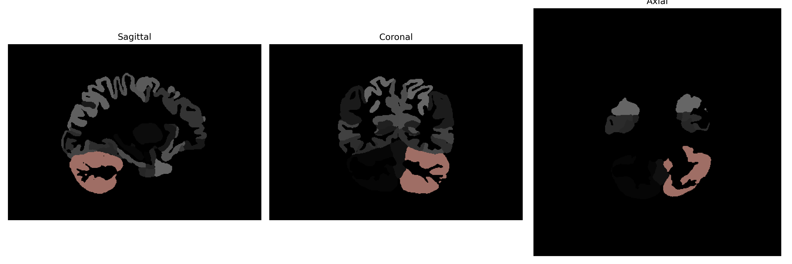

# Cerebellum-Exterior

## Overview

The Left Cerebellum-Exterior is a component of the cerebellum, which is located at the posterior part of the brain, inferior to the occipital lobes and dorsal to the brainstem. The cerebellum is primarily responsible for coordination of voluntary movements, balance, and posture. The exterior portion refers to the surface of the left hemisphere of the cerebellum, which is richly folded into fine transverse fissures and lobules, enhancing its surface area. This structure contributes significantly to the integration of sensory perception and motor control. It receives input from the sensory systems, spinal cord, and other parts of the brain and coordinates the timing and force of different muscle groups to produce smooth, coordinated movements.

There is no direct Wikipedia link for the Left Cerebellum-Exterior. However, for more general information, the cerebellum is a related structure: [Cerebellum on Wikipedia](https://en.wikipedia.org/wiki/Cerebellum).

*Overview generated by GPT-4o (2026).*

---

**Region ID:** 8  
**Hemisphere:** Left  
**Atlas:** brainCOLOR 

---

## Full Brain – Black Background

**Full Quality Version:** [Download MP4](full_black.mp4)

---

## Full Brain – White Background

**Full Quality Version:** [Download MP4](full_white.mp4)

---

## Hemisphere Only – Black Background

**Full Quality Version:** [Download MP4](hemi_black.mp4)

---

## Hemisphere Only – White Background

**Full Quality Version:** [Download MP4](hemi_white.mp4)

---

## Triplanar View (Centered on ROI)

