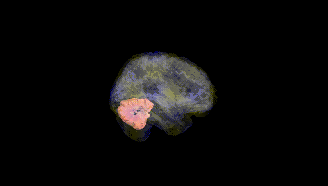
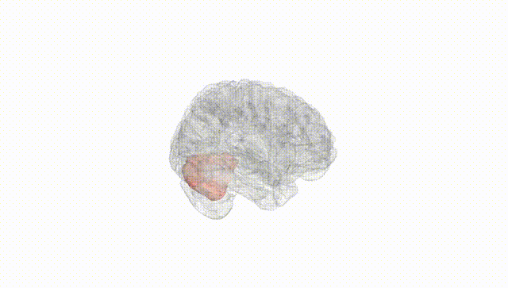
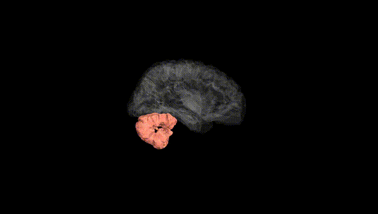
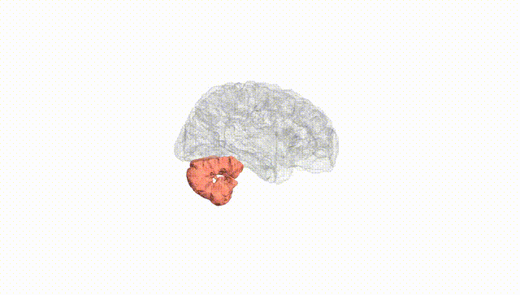
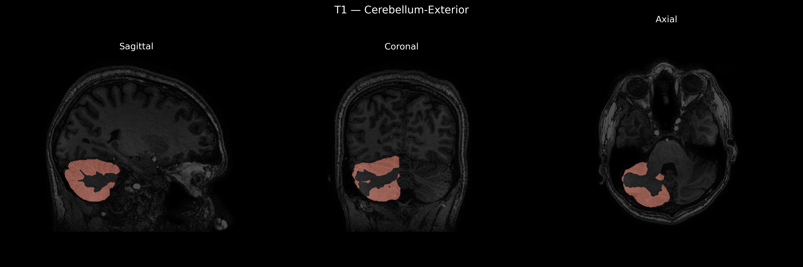
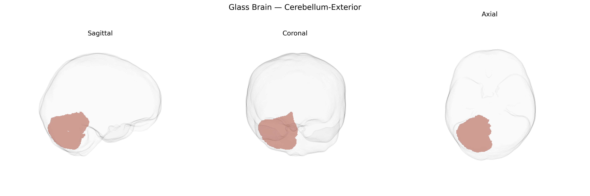

# Cerebellum-Exterior
 
## Overview
 
The Right Cerebellum-Exterior, as defined in the brainCOLOR Atlas, encompasses the superficial cortical mantle of the right cerebellar hemisphere, including the outer portions of its characteristic folia and lobules. This region primarily participates in the fine-tuning of motor activity, contributing to coordination, precision, and timing of movements, as well as the integration of sensory input required for postural control and motor learning. In addition to its motor functions, the right cerebellar cortex is implicated in higher-order processes such as aspects of language, working memory, and executive functions, through reciprocal connectivity with contralateral cerebral association areas and thalamic nuclei. Anatomically, the Right Cerebellum-Exterior is supplied by branches of the superior, anterior inferior, and posterior inferior cerebellar arteries and is organized into a layered cortex overlying deep cerebellar white matter and nuclei. There is no direct Wikipedia article for “Right Cerebellum-Exterior”; see the related structure [Cerebellum](https://en.wikipedia.org/wiki/Cerebellum).
 
The Right Cerebellum-Exterior region in the brainCOLOR atlas has not been a primary, consistently isolated target in large-scale GWAS, but genetic studies implicate cerebellar structure and function—including right-hemisphere and lateral cerebellar zones—in several traits and disorders. Variants near genes involved in neurodevelopment and synaptic function (e.g., MAPT, KIAA0586/TALPID3, RELN, and several loci enriched for neuronal and oligodendrocyte-expressed genes) have been linked to global and regional cerebellar volume and cortical thickness in imaging-genetics consortia such as ENIGMA and UK Biobank analyses, which often show partially lateralized effects. Cerebellar morphology, including right-sided regions, has been associated with polygenic risk for schizophrenia, bipolar disorder, and major depression, as well as with cognitive performance, general intelligence, educational attainment, and neuroticism. Additional imaging-GWAS work indicates that genetic variants influencing cerebellar networks contribute to risk for autism spectrum disorder, attention-deficit/hyperactivity disorder, and motor-coordination and balance phenotypes, although these findings usually refer to broader cerebellar lobules or functional networks rather than a narrowly defined “Right Cerebellum-Exterior” parcel. Overall, the genetic architecture of this region appears highly polygenic and overlapping with that of other association cortex–connected cerebellar territories, with shared variants contributing to both psychiatric vulnerability and cognitive variation.
 
*Overview generated by GPT-4o (2026).*
 
---
 
**Region ID:** 7  
**Hemisphere:** Right  
**Atlas:** brainCOLOR 
 
---
 
## Cerebellum-Exterior – Black Background (Full Brain)
 

 
**Full Quality Version:** <a href="full_black.mp4" download>Download MP4</a>
 
---
 
## Cerebellum-Exterior – White Background (Full Brain)
 

 
**Full Quality Version:** <a href="full_white.mp4" download>Download MP4</a>
 
---

## Cerebellum-Exterior – Black Background (Hemisphere)
 

 
**Full Quality Version:** <a href="hemi_black.mp4" download>Download MP4</a>
 
---
 
## Cerebellum-Exterior – White Background (Hemisphere)
 

 
**Full Quality Version:** <a href="hemi_white.mp4" download>Download MP4</a>
 
---

## Triplanar View – T1 Background
 

 
---
 
## Triplanar View – Ghost Brain
 


