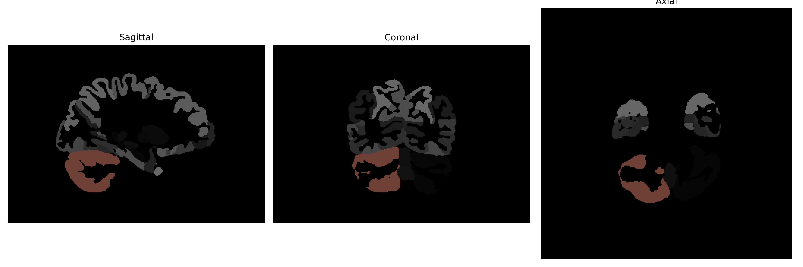

# Cerebellum-Exterior

## Overview

The Right Cerebellum-Exterior region, as represented in the brainCOLOR Atlas, pertains to the outer surface of the right hemisphere of the cerebellum, a critical structure involved in motor control and coordination. This region is essential for the integration of sensory perception and motor output, facilitating smooth and precise execution of voluntary movements. The cerebellum's exterior is involved in the fine-tuning of motor activities, balance, posture, and motor learning, contributing to the cognitive processes and supporting procedural memory functions. The exterior layer consists of tightly packed neurons and numerous granule cells within a laminated cortex, enabling it to process a vast amount of incoming sensory information.

There is no direct link to the specific description of the Right Cerebellum-Exterior in the brainCOLOR Atlas, but a related structure is the cerebellum in general. A relevant Wikipedia link is: https://en.wikipedia.org/wiki/Cerebellum

*Overview generated by GPT-4o (2026).*

---

**Region ID:** 7  
**Hemisphere:** Right  
**Atlas:** brainCOLOR 

---

## Full Brain – Black Background

**Full Quality Version:** [Download MP4](full_black.mp4)

---

## Full Brain – White Background

**Full Quality Version:** [Download MP4](full_white.mp4)

---

## Hemisphere Only – Black Background

**Full Quality Version:** [Download MP4](hemi_black.mp4)

---

## Hemisphere Only – White Background

**Full Quality Version:** [Download MP4](hemi_white.mp4)

---

## Triplanar View (Centered on ROI)

