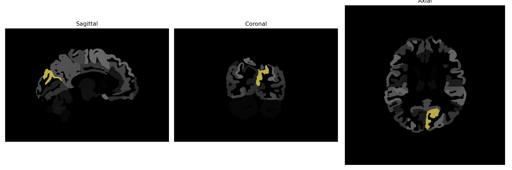

# cuneus

## Overview

The left cuneus is a region located in the occipital lobe of the human brain, primarily associated with processing visual information. Positioned above the calcarine fissure, it plays a critical role in basic visual functions such as motion perception, spatial orientation, and binocular vision, which are essential for interpreting complex visual stimuli. The cuneus forms part of the primary visual cortex (V1, Brodmann area 17), where initial cortical processing of visual input from the eyes begins. Due to its involvement in visual processing, the left cuneus connects with other occipital regions and supplementary visual areas to enable higher-order visual integration and interpretation.

There is no direct link to the brainCOLOR Atlas description of the left cuneus. For related information, visit the Wikipedia page on the occipital lobe: [https://en.wikipedia.org/wiki/Occipital_lobe](https://en.wikipedia.org/wiki/Occipital_lobe).

*Overview generated by GPT-4o (2026).*

---

**Region ID:** 37  
**Hemisphere:** Left  
**Atlas:** brainCOLOR 

---

## Full Brain – Black Background

**Full Quality Version:** [Download MP4](full_black.mp4)

---

## Full Brain – White Background

**Full Quality Version:** [Download MP4](full_white.mp4)

---

## Hemisphere Only – Black Background

**Full Quality Version:** [Download MP4](hemi_black.mp4)

---

## Hemisphere Only – White Background

**Full Quality Version:** [Download MP4](hemi_white.mp4)

---

## Triplanar View (Centered on ROI)

