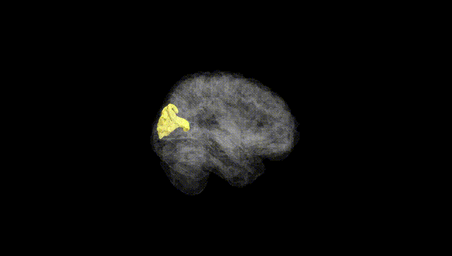
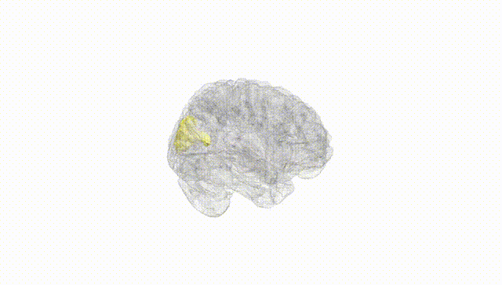
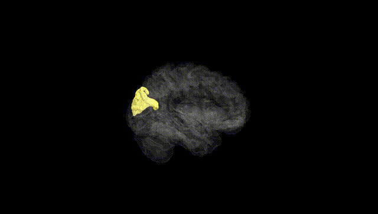
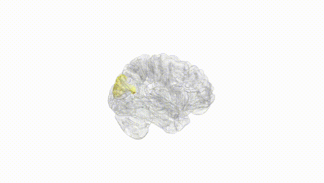
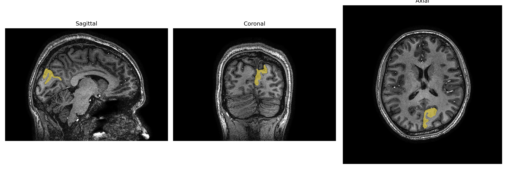
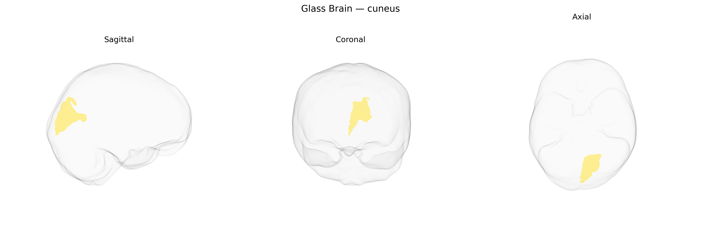

# cuneus

## Overview

The left cuneus is a medial occipital lobe cortical region situated between the parieto-occipital sulcus dorsally and the calcarine sulcus ventrally, forming part of the primary and secondary visual cortices. It is predominantly involved in basic and higher-order visual processing, including visual attention, spatial orientation, and integration of visual information from the contralateral (right) visual field, particularly the lower quadrants when considering its primary visual components. The left cuneus receives major afferent input from the lateral geniculate nucleus via the optic radiations and has reciprocal connections with other occipital, parietal, and temporal visual association areas, as well as with attentional and oculomotor networks. Functionally, it contributes to visuospatial processing, visual imagery, and aspects of visual working memory, and is commonly activated in neuroimaging studies involving visual perception and attentional tasks.  

Wikipedia URL: https://en.wikipedia.org/wiki/Cuneus

*Overview generated by GPT-4o (2026).*

---

**Region ID:** 37  
**Hemisphere:** Left  
**Atlas:** brainCOLOR 

---

## cuneus – Black Background (Full Brain)

**Full Quality Version:** [Download MP4](full_black.mp4)

---

## cuneus – White Background (Full Brain)

**Full Quality Version:** [Download MP4](full_white.mp4)

---

## cuneus – Black Background (Hemisphere)

**Full Quality Version:** [Download MP4](hemi_black.mp4)

---

## cuneus – White Background (Hemisphere)

**Full Quality Version:** [Download MP4](hemi_white.mp4)

---

## Triplanar View – T1 Background

---

## Triplanar View – Ghost Brain


