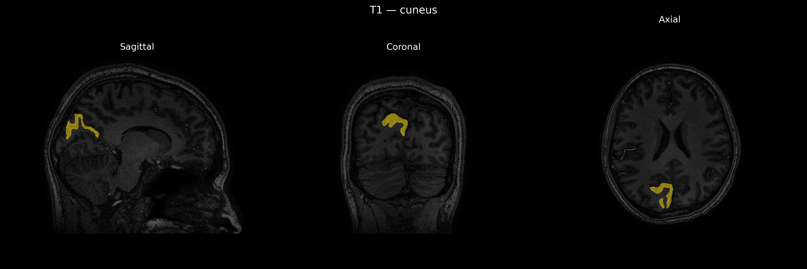
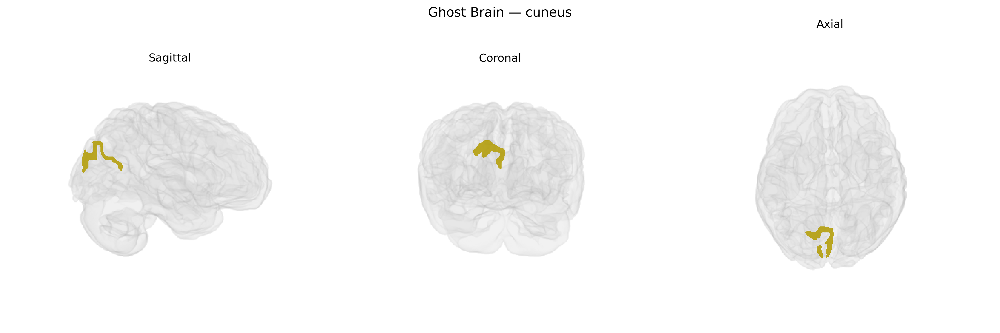

# cuneus

## Overview

The right cuneus is a wedge-shaped cortical region located on the medial surface of the right occipital lobe, bordered superiorly by the parieto-occipital sulcus and inferiorly by the calcarine sulcus. It encompasses portions of primary and secondary visual cortex, including parts of Brodmann areas 17, 18, and 19, and is primarily involved in early-stage visual processing, particularly of the contralateral (left) visual field. The right cuneus participates in basic visual feature analysis (such as orientation, spatial frequency, and contrast), visuospatial attention, and integration of visual information with higher-order networks involved in perception and visual imagery. Through extensive connectivity with other occipital, parietal, and temporal visual areas, as well as thalamic nuclei (notably the lateral geniculate nucleus), this region contributes to constructing coherent representations of the external visual environment. There is no direct Wikipedia page for the “right cuneus” as a hemisphere-specific entry; a related and encompassing structure is described here: https://en.wikipedia.org/wiki/Cuneus.

*Overview generated by GPT-4o (2026).*

---

**Region ID:** 36  
**Hemisphere:** Right  
**Atlas:** brainCOLOR 

---

## Full Brain – Black Background

**Full Quality Version:** [Download MP4](full_black.mp4)

---

## Full Brain – White Background

**Full Quality Version:** [Download MP4](full_white.mp4)

---

## Hemisphere Only – Black Background

**Full Quality Version:** [Download MP4](hemi_black.mp4)

---

## Hemisphere Only – White Background

**Full Quality Version:** [Download MP4](hemi_white.mp4)

---

## Triplanar View – T1 Background

---

## Triplanar View – Ghost Brain


