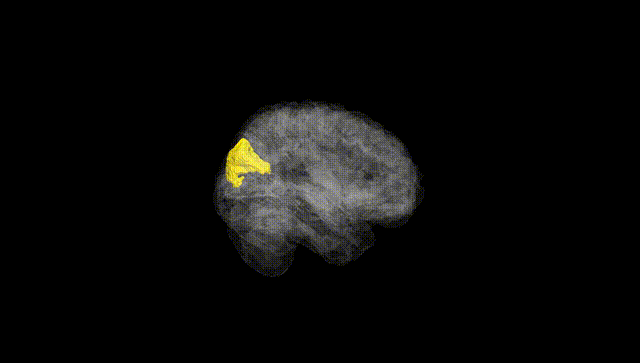
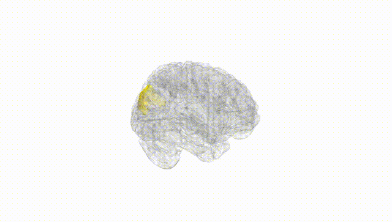
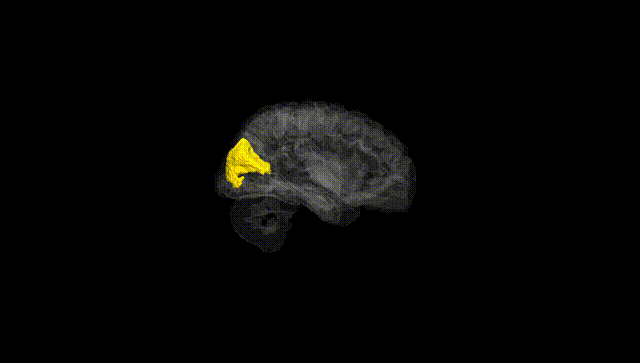
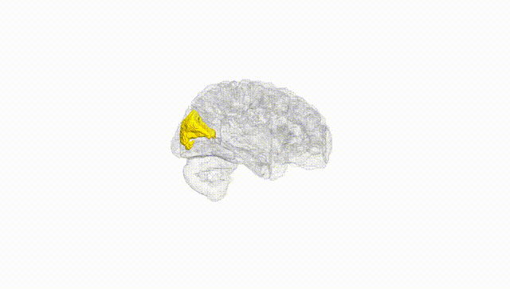
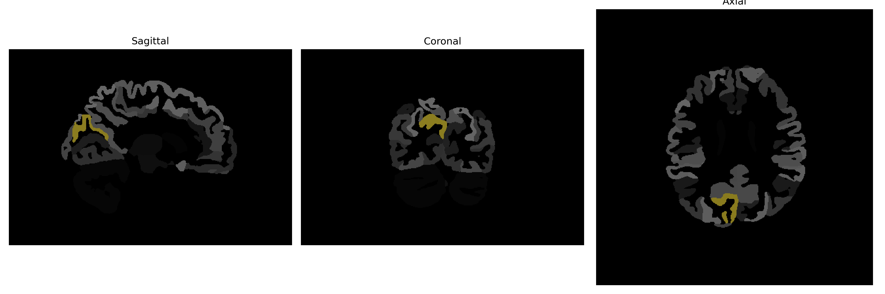

# cuneus

## Overview

The right cuneus is a region in the occipital lobe of the human brain, characterized by its location above the calcarine sulcus. This region is primarily involved in processing visual information, particularly basic visual stimuli such as orientation, spatial frequency, and peripheral vision. The cuneus integrates visual inputs from both eyes, contributing to binocular vision and visual perception. It plays a crucial role in visual attention, tasks requiring visual alertness, and the early stages of visual processing within the primary visual cortex. 

There is no direct Wikipedia link for the right cuneus specifically; however, the cuneus as part of the occipital lobe can be explored further at the following URL: [https://en.wikipedia.org/wiki/Cuneus](https://en.wikipedia.org/wiki/Cuneus).

*Overview generated by GPT-4o (2026).*

---

**Region ID:** 36  
**Hemisphere:** Right  
**Atlas:** brainCOLOR 

---

## Full Brain – Black Background

**Full Quality Version:** [Download MP4](full_black.mp4)

---

## Full Brain – White Background

**Full Quality Version:** [Download MP4](full_white.mp4)

---

## Hemisphere Only – Black Background

**Full Quality Version:** [Download MP4](hemi_black.mp4)

---

## Hemisphere Only – White Background

**Full Quality Version:** [Download MP4](hemi_white.mp4)

---

## Triplanar View (Centered on ROI)

