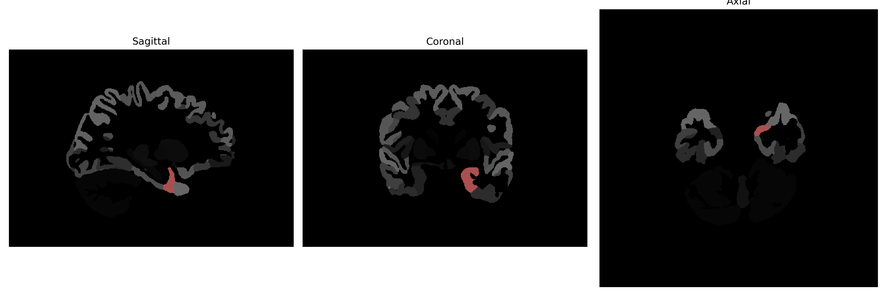

# entorhinal-area

## Overview

The left entorhinal-area is a region located in the medial temporal lobe of the brain, playing a crucial role in memory processing and spatial navigation. It serves as a major interface between the hippocampus and neocortex, responsible for the integration and relay of sensory and mnemonic information. This area is known for its involvement in the formation of episodic memories and is one of the first regions to exhibit pathological changes in Alzheimer's disease. The organization of neurons in the entorhinal cortex, showing a distinct hexagonal grid-like firing pattern, is fundamental to understanding its role in spatial memory and cognition.

There is no direct Wikipedia link to the Left entorhinal-area as described in the brainCOLOR Atlas, but more information about the entorhinal cortex can be found here: [Entorhinal cortex](https://en.wikipedia.org/wiki/Entorhinal_cortex).

*Overview generated by GPT-4o (2026).*

---

**Region ID:** 39  
**Hemisphere:** Left  
**Atlas:** brainCOLOR 

---

## Full Brain – Black Background

**Full Quality Version:** [Download MP4](full_black.mp4)

---

## Full Brain – White Background

**Full Quality Version:** [Download MP4](full_white.mp4)

---

## Hemisphere Only – Black Background

**Full Quality Version:** [Download MP4](hemi_black.mp4)

---

## Hemisphere Only – White Background

**Full Quality Version:** [Download MP4](hemi_white.mp4)

---

## Triplanar View (Centered on ROI)

