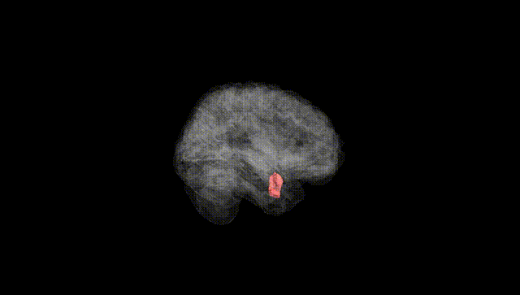
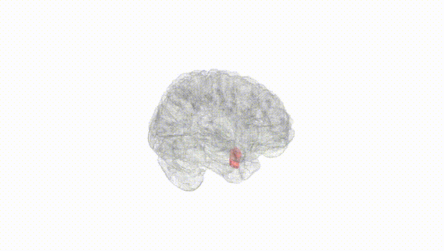
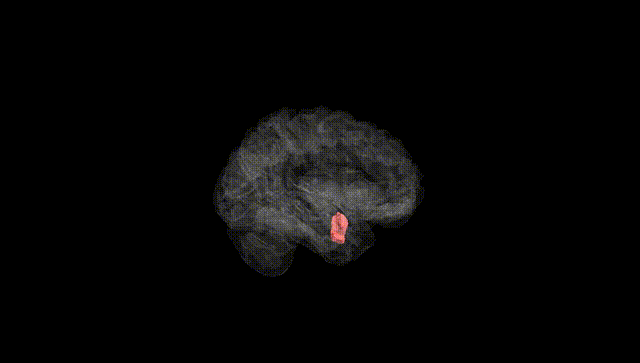
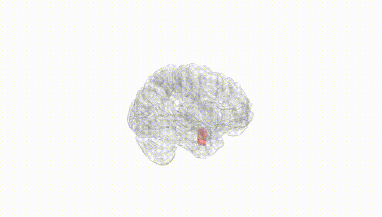
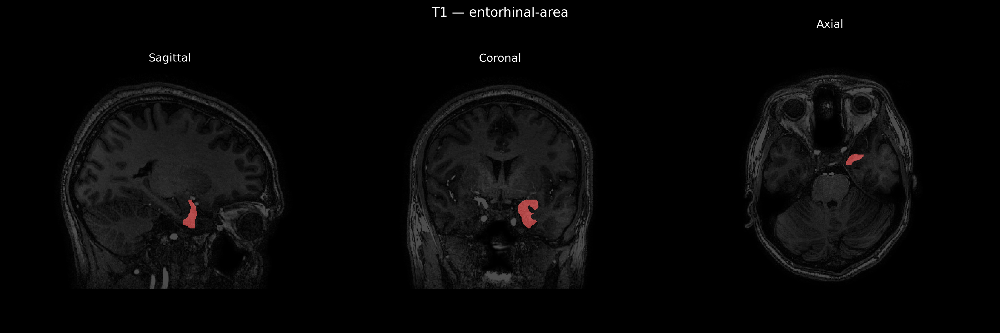
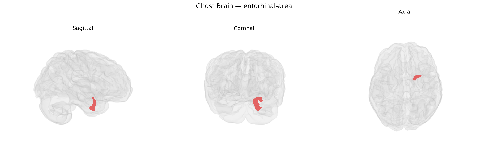

# entorhinal-area

## Overview

The left entorhinal area (left entorhinal cortex) is a medial temporal lobe structure that serves as a major interface between the neocortex and the hippocampal formation, playing a critical role in episodic memory, spatial navigation, and consolidation of information. It lies in the parahippocampal gyrus, adjacent to the hippocampus, and receives highly processed multimodal sensory input from widespread cortical association areas, which it funnels into the hippocampal circuitry via the perforant pathway. Cytoarchitectonically, it is part of the allocortex and exhibits characteristic layer II stellate cells and layer III pyramidal neurons that project to distinct hippocampal subfields. The left entorhinal area, in particular, is often studied in the context of verbal memory and is notably vulnerable to early neurodegenerative changes in Alzheimer’s disease, where it shows some of the earliest tau pathology and atrophy. There is no direct Wikipedia link for the “Left entorhinal-area” as defined in the brainCOLOR Atlas; a closely related and encompassing structure is the entorhinal cortex: https://en.wikipedia.org/wiki/Entorhinal_cortex

*Overview generated by GPT-4o (2026).*

---

**Region ID:** 39  
**Hemisphere:** Left  
**Atlas:** brainCOLOR 

---

## Full Brain – Black Background

**Full Quality Version:** [Download MP4](full_black.mp4)

---

## Full Brain – White Background

**Full Quality Version:** [Download MP4](full_white.mp4)

---

## Hemisphere Only – Black Background

**Full Quality Version:** [Download MP4](hemi_black.mp4)

---

## Hemisphere Only – White Background

**Full Quality Version:** [Download MP4](hemi_white.mp4)

---

## Triplanar View – T1 Background

---

## Triplanar View – Ghost Brain


