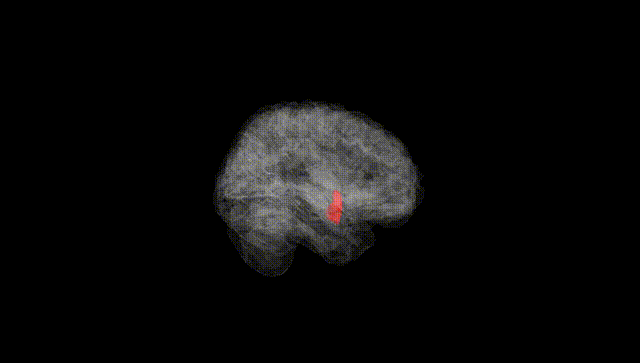
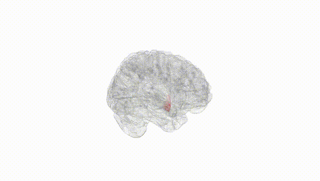
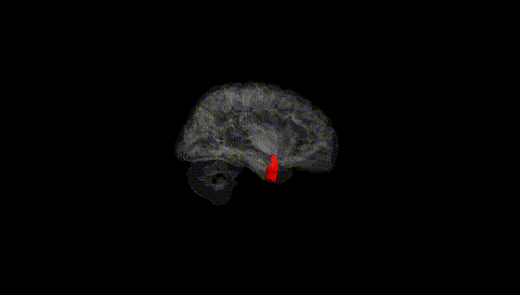
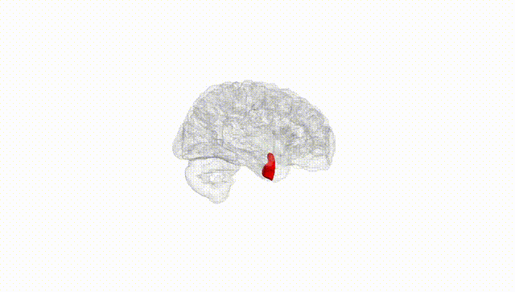
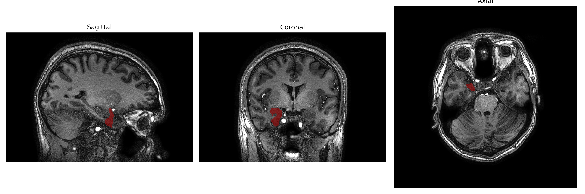
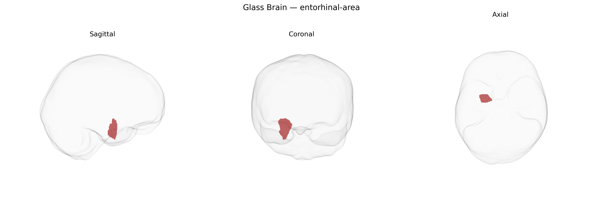

# entorhinal-area

## Overview

The right entorhinal area is a medial temporal lobe cortical region that serves as a major interface between the neocortex and the hippocampal formation, playing a key role in declarative memory, spatial navigation, and consolidation of long-term memories. It receives highly processed multimodal sensory input from widespread cortical association areas and relays this information to the hippocampus via the perforant pathway, while also receiving reciprocal hippocampal output. Cytoarchitectonically, it is characterized by distinct lamination patterns and specialized cell types, including grid cells and other spatially tuned neurons, which contribute to metric representation of space and episodic context. Functionally and clinically, the entorhinal cortex is critically involved in early stages of neurodegenerative diseases such as Alzheimer’s disease, where it shows some of the earliest tau pathology and atrophy, particularly impacting memory and navigation performance. There is no direct Wikipedia link specifically for the “Right entorhinal-area” brainCOLOR Atlas region; a closely related structure is described here: https://en.wikipedia.org/wiki/Entorhinal_cortex

*Overview generated by GPT-4o (2026).*

---

**Region ID:** 38  
**Hemisphere:** Right  
**Atlas:** brainCOLOR 

---

## entorhinal-area – Black Background (Full Brain)

**Full Quality Version:** [Download MP4](full_black.mp4)

---

## entorhinal-area – White Background (Full Brain)

**Full Quality Version:** [Download MP4](full_white.mp4)

---

## entorhinal-area – Black Background (Hemisphere)

**Full Quality Version:** [Download MP4](hemi_black.mp4)

---

## entorhinal-area – White Background (Hemisphere)

**Full Quality Version:** [Download MP4](hemi_white.mp4)

---

## Triplanar View – T1 Background

---

## Triplanar View – Ghost Brain


