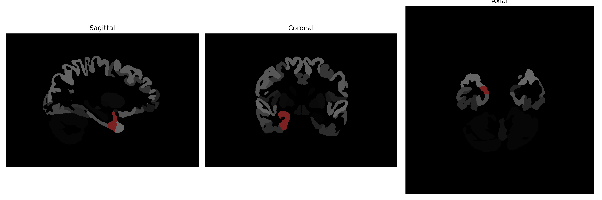

# entorhinal-area

## Overview

The right entorhinal area of the brain is a part of the entorhinal cortex, which plays a crucial role in memory and navigation. Positioned in the medial temporal lobe, this region serves as a prominent hub, interfacing between the hippocampus and neocortex. It is involved in various cognitive processes, particularly in spatial memory and the consolidation of information from short-term to long-term memory. The entorhinal cortex receives highly processed sensory information and conveys it to the hippocampus, making it integral to the limbic system's function of linking various sensory modalities with emotions and memory. Notably, the entorhinal cortex is one of the first regions to be affected in Alzheimer's disease, showing signs of neurodegeneration in its initial stages.

There is no direct Wikipedia link for the right entorhinal-area as described in the brainCOLOR Atlas. However, more information on its overall structure can be found here: [Entorhinal cortex on Wikipedia](https://en.wikipedia.org/wiki/Entorhinal_cortex).

*Overview generated by GPT-4o (2026).*

---

**Region ID:** 38  
**Hemisphere:** Right  
**Atlas:** brainCOLOR 

---

## Full Brain – Black Background

**Full Quality Version:** [Download MP4](full_black.mp4)

---

## Full Brain – White Background

**Full Quality Version:** [Download MP4](full_white.mp4)

---

## Hemisphere Only – Black Background

**Full Quality Version:** [Download MP4](hemi_black.mp4)

---

## Hemisphere Only – White Background

**Full Quality Version:** [Download MP4](hemi_white.mp4)

---

## Triplanar View (Centered on ROI)

