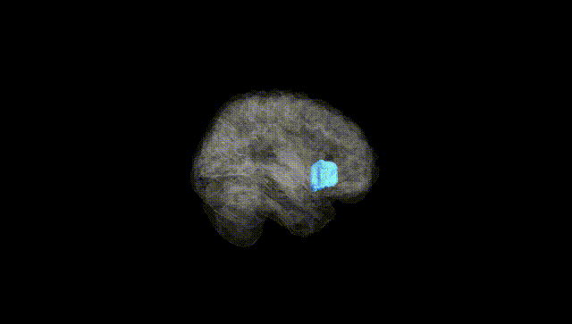
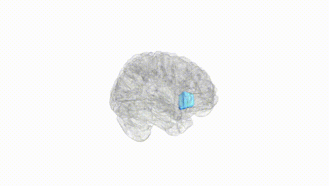
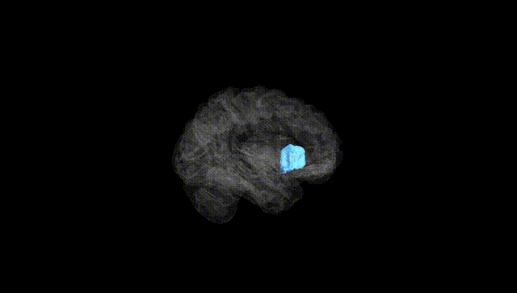
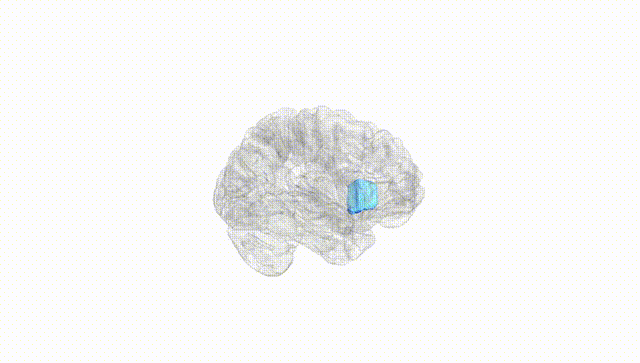
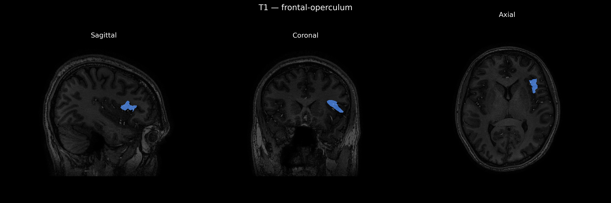
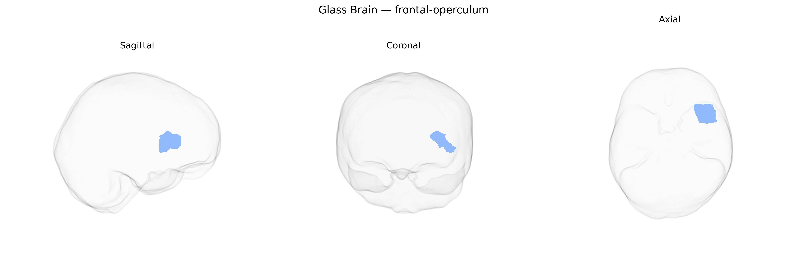

# frontal-operculum
 
## Overview
 
The left frontal operculum is a cortical region forming part of the ventrolateral frontal lobe, overlying the insula and bordered by the inferior frontal gyrus and Sylvian fissure. In the dominant (usually left) hemisphere, it encompasses parts of the pars opercularis and adjacent regions that contribute to language production, phonological processing, and complex motor planning for speech. This area is strongly associated with Broca’s region and participates in networks supporting syntactic processing, verbal working memory, and articulation. It is interconnected with temporal and parietal language areas, as well as premotor and insular cortices, enabling integration of linguistic, motor, and sensorimotor information relevant to expressive language and orofacial control. There is no direct link; see [Inferior frontal gyrus](https://en.wikipedia.org/wiki/Inferior_frontal_gyrus).
 
The left frontal operculum, which includes portions of the inferior frontal gyrus and neighboring perisylvian cortex, has been implicated by imaging genetics and GWAS-based brain morphology studies in several language, cognitive, and psychiatric phenotypes, although specific brainCOLOR Atlas–targeted genetic analyses are limited. Large-scale neuroimaging GWAS (e.g., ENIGMA, UK Biobank) have identified common variants near genes involved in neurodevelopment, synaptic function, and axon guidance (such as FOXP2, CNTNAP2, DCDC2, and KIAA0319) that show associations with cortical thickness or surface area in inferior frontal and opercular regions, often in the left hemisphere, consistent with their roles in speech, language, and reading. Polygenic risk scores for schizophrenia, bipolar disorder, and major depressive disorder have also been linked to structural and functional variation in the left frontal operculum and adjacent inferior frontal cortex, mirroring case–control findings of reduced gray matter or altered activation during language and cognitive control tasks. Additionally, variants associated with developmental language disorder, dyslexia, stuttering, and autism spectrum disorder show convergent effects on perisylvian networks that prominently include the left frontal operculum, suggesting that genetic influences on this region contribute to individual differences in verbal fluency, phonological processing, and social-communication abilities.
 
*Overview generated by GPT-4o (2026).*
 
---
 
**Region ID:** 41  
**Hemisphere:** Left  
**Atlas:** brainCOLOR 
 
---
 
## frontal-operculum – Black Background (Full Brain)
 

 
**Full Quality Version:** <a href="full_black.mp4" download>Download MP4</a>
 
---
 
## frontal-operculum – White Background (Full Brain)
 

 
**Full Quality Version:** <a href="full_white.mp4" download>Download MP4</a>
 
---

## frontal-operculum – Black Background (Hemisphere)
 

 
**Full Quality Version:** <a href="hemi_black.mp4" download>Download MP4</a>
 
---
 
## frontal-operculum – White Background (Hemisphere)
 

 
**Full Quality Version:** <a href="hemi_white.mp4" download>Download MP4</a>
 
---

## Triplanar View – T1 Background
 

 
---
 
## Triplanar View – Ghost Brain
 


