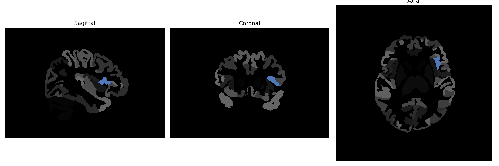

# frontal-operculum

## Overview

The left frontal-operculum is a region located in the frontal lobe of the brain, specifically within the opercular section that is adjacent to the insular cortex. It plays a crucial role in several higher cognitive processes, particularly those involving language comprehension and production, given its proximity to Broca's area. The opercular area is characterized by its involvement in the complex network structures that support both linguistic and motor functions, and it is integrated with multiple cortical and subcortical areas to facilitate these processes. The left frontal-operculum's role in these functions is supported by its connections to the basal ganglia, thalamus, and various other regions involved in the execution of intricate brain tasks.

There is no direct link to the Left frontal-operculum in Wikipedia, but there is a related page on the operculum in brain structures: https://en.wikipedia.org/wiki/Operculum_(brain).

*Overview generated by GPT-4o (2026).*

---

**Region ID:** 41  
**Hemisphere:** Left  
**Atlas:** brainCOLOR 

---

## Full Brain – Black Background

**Full Quality Version:** [Download MP4](full_black.mp4)

---

## Full Brain – White Background

**Full Quality Version:** [Download MP4](full_white.mp4)

---

## Hemisphere Only – Black Background

**Full Quality Version:** [Download MP4](hemi_black.mp4)

---

## Hemisphere Only – White Background

**Full Quality Version:** [Download MP4](hemi_white.mp4)

---

## Triplanar View (Centered on ROI)

