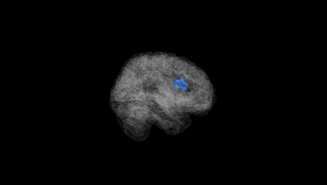
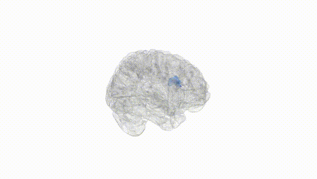
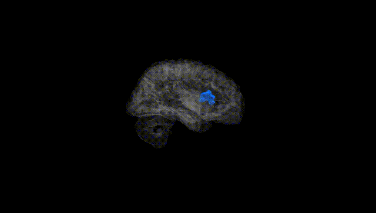
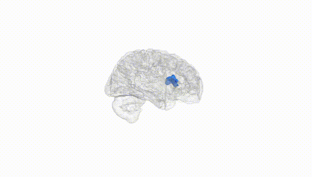
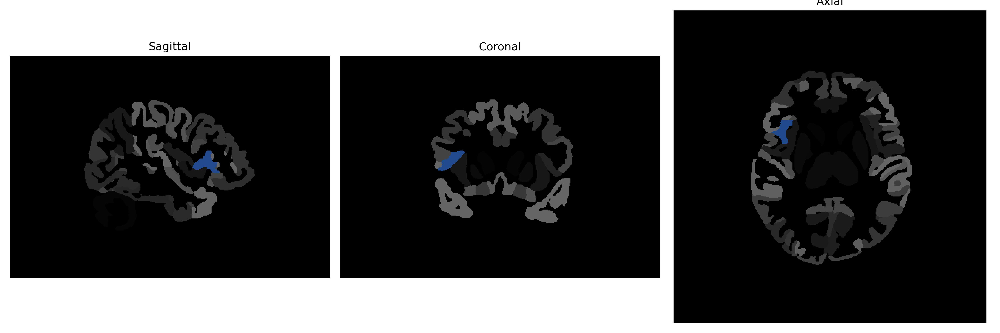

# frontal-operculum

## Overview

The right frontal-operculum is a region located in the frontal lobe of the brain, specifically in the right hemisphere, and is part of the operculum which is involved in the function of language processing and production, motor control, and integrating sensory information. This area is positioned near the Sylvian fissure, which separates the frontal and temporal lobes, and it plays a critical role in higher cognitive functions, including decision-making and social behavior. The frontal-operculum is associated with the Broca's area, which is essential for language production and comprehension, contributing to speech motor planning and complex cognitive tasks.

There is no direct link to a description of the right frontal-operculum on Wikipedia. However, a related area within the frontal lobe that can be explored is the [Frontal lobe](https://en.wikipedia.org/wiki/Frontal_lobe).

*Overview generated by GPT-4o (2026).*

---

**Region ID:** 40  
**Hemisphere:** Right  
**Atlas:** brainCOLOR 

---

## Full Brain – Black Background

**Full Quality Version:** [Download MP4](full_black.mp4)

---

## Full Brain – White Background

**Full Quality Version:** [Download MP4](full_white.mp4)

---

## Hemisphere Only – Black Background

**Full Quality Version:** [Download MP4](hemi_black.mp4)

---

## Hemisphere Only – White Background

**Full Quality Version:** [Download MP4](hemi_white.mp4)

---

## Triplanar View (Centered on ROI)

