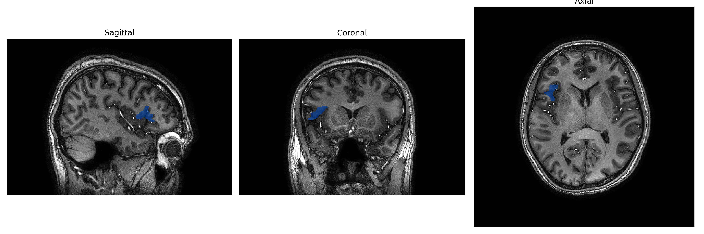
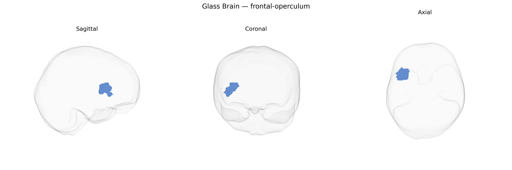

# frontal-operculum

## Overview

The right frontal operculum is a cortical region located on the ventrolateral surface of the right frontal lobe, overlying the insula and forming part of the opercular cover of the lateral sulcus. Biologically, it includes portions of the inferior frontal gyrus (typically involving parts of the pars opercularis and adjacent cortex) and participates in networks subserving cognitive control, response inhibition, language-related processing (particularly prosody and aspects of speech production and articulation), and integration of sensorimotor information. It is structurally and functionally connected with premotor, insular, and parietal opercular areas, as well as subcortical structures involved in executive and salience networks. In the brainCOLOR atlas, this region is defined as a functionally coherent area within the frontal opercular complex, distinct from but closely related to neighboring inferior frontal and insular territories. There is no direct Wikipedia page for the “right frontal operculum” as labeled in the brainCOLOR Atlas; a closely related and encompassing structure is the frontal operculum: https://en.wikipedia.org/wiki/Frontal_operculum.

*Overview generated by GPT-4o (2026).*

---

**Region ID:** 40  
**Hemisphere:** Right  
**Atlas:** brainCOLOR 

---

## frontal-operculum – Black Background (Full Brain)

**Full Quality Version:** [Download MP4](full_black.mp4)

---

## frontal-operculum – White Background (Full Brain)

**Full Quality Version:** [Download MP4](full_white.mp4)

---

## frontal-operculum – Black Background (Hemisphere)

**Full Quality Version:** [Download MP4](hemi_black.mp4)

---

## frontal-operculum – White Background (Hemisphere)

**Full Quality Version:** [Download MP4](hemi_white.mp4)

---

## Triplanar View – T1 Background

---

## Triplanar View – Ghost Brain


