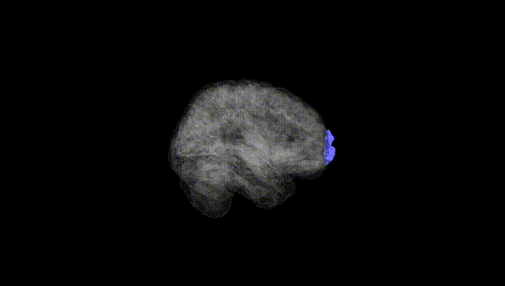
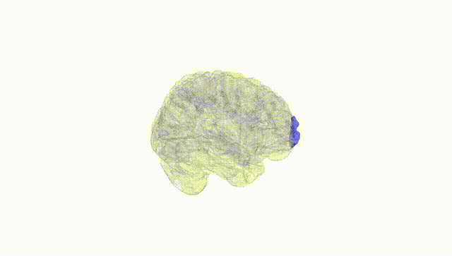
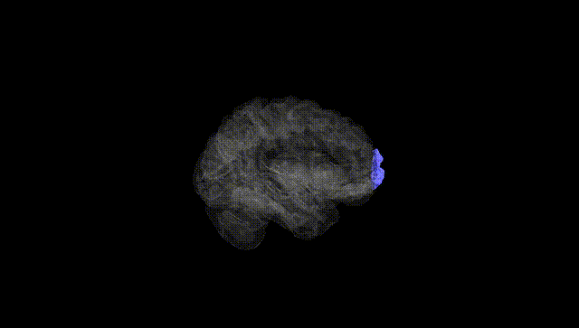
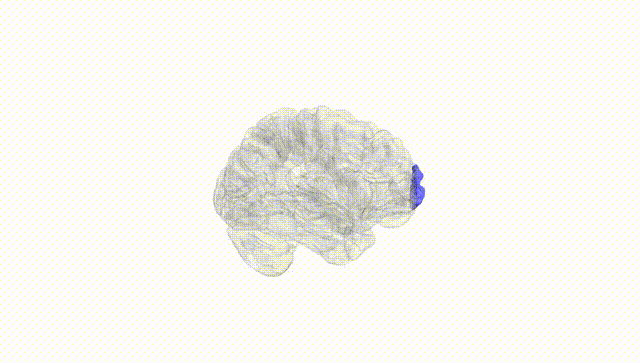
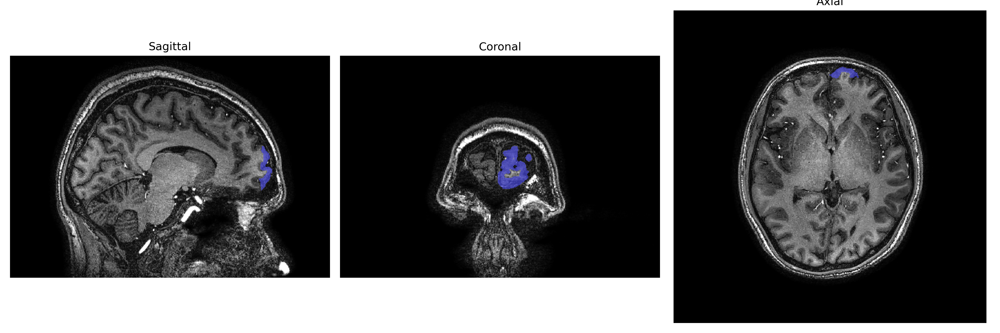
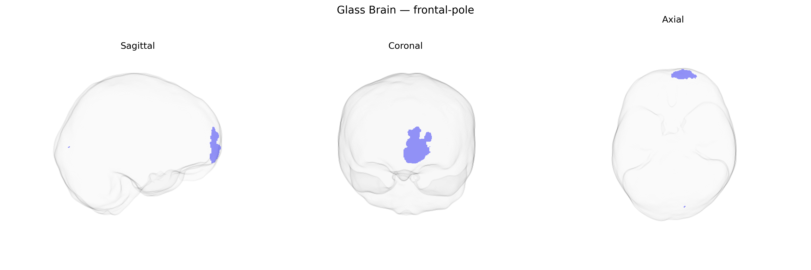

# frontal-pole

## Overview

The left frontal pole is the most anterior portion of the left frontal lobe, corresponding roughly to Brodmann area 10, and is part of the higher-order association cortex implicated in complex, integrative cognitive functions. It participates in prospective memory, multitasking, abstract reasoning, social cognition, and the coordination of internal goals with external stimuli, often functioning as a hub that integrates information from lateral prefrontal, orbitofrontal, and limbic regions. Structurally, it is located anterior to the superior and middle frontal gyri and is supplied by branches of the anterior cerebral and middle cerebral arteries. In functional neuroimaging, left frontal pole activity is frequently associated with tasks requiring evaluation of alternative courses of action, maintenance of long-term intentions, and metacognitive processes.  

There is no direct Wikipedia page for the “left frontal-pole” as defined in the brainCOLOR Atlas; a closely related structure is the frontal pole cortex: https://en.wikipedia.org/wiki/Frontal_pole_cortex

*Overview generated by GPT-4o (2026).*

---

**Region ID:** 43  
**Hemisphere:** Left  
**Atlas:** brainCOLOR 

---

## frontal-pole – Black Background (Full Brain)

**Full Quality Version:** [Download MP4](full_black.mp4)

---

## frontal-pole – White Background (Full Brain)

**Full Quality Version:** [Download MP4](full_white.mp4)

---

## frontal-pole – Black Background (Hemisphere)

**Full Quality Version:** [Download MP4](hemi_black.mp4)

---

## frontal-pole – White Background (Hemisphere)

**Full Quality Version:** [Download MP4](hemi_white.mp4)

---

## Triplanar View – T1 Background

---

## Triplanar View – Ghost Brain


