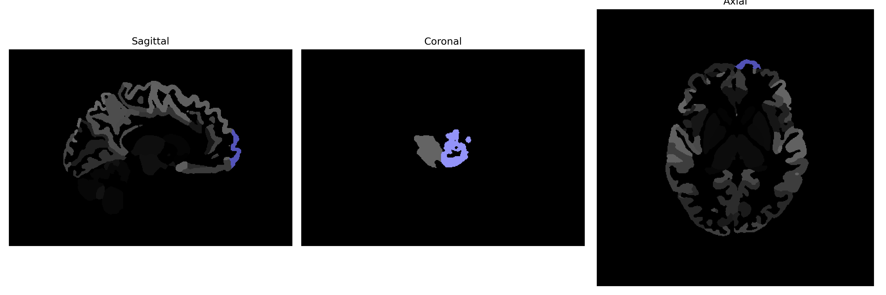

# frontal-pole

## Overview

The left frontal-pole brain region, often referred to as BA10 (Brodmann area 10), is located at the most anterior part of the frontal lobe. As part of the prefrontal cortex, this region is involved in higher cognitive functions including executive functions, decision making, and moderating social behavior. It plays a critical role in abstract thinking, attention, and the integration of sensory and mnemonic information. This area is also integral in personality expression and moderating complex cognitive activities. The left frontal-pole region is uniquely situated to integrate inputs from a multitude of neural pathways, emphasizing its role in complex cognitive processes.

There is no direct Wikipedia link to this specific description. However, more information about the broader Brodmann area 10, which encompasses the frontal-pole region, can be found here: [https://en.wikipedia.org/wiki/Brodmann_area_10](https://en.wikipedia.org/wiki/Brodmann_area_10).

*Overview generated by GPT-4o (2026).*

---

**Region ID:** 43  
**Hemisphere:** Left  
**Atlas:** brainCOLOR 

---

## Full Brain – Black Background

**Full Quality Version:** [Download MP4](full_black.mp4)

---

## Full Brain – White Background

**Full Quality Version:** [Download MP4](full_white.mp4)

---

## Hemisphere Only – Black Background

**Full Quality Version:** [Download MP4](hemi_black.mp4)

---

## Hemisphere Only – White Background

**Full Quality Version:** [Download MP4](hemi_white.mp4)

---

## Triplanar View (Centered on ROI)

