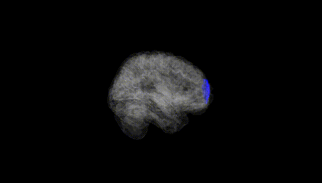
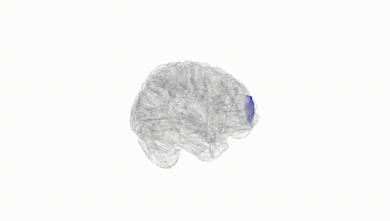
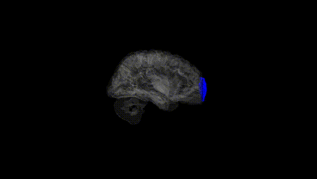
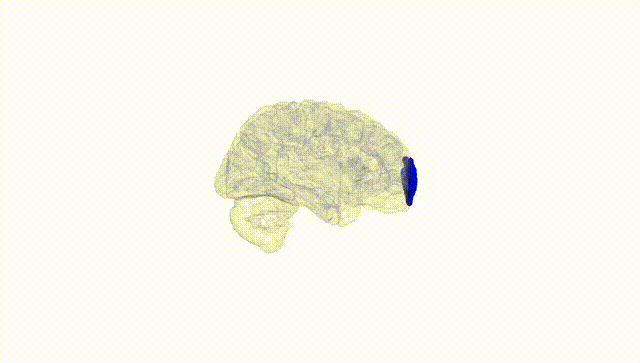
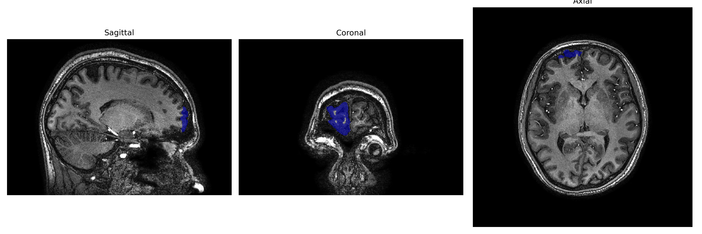
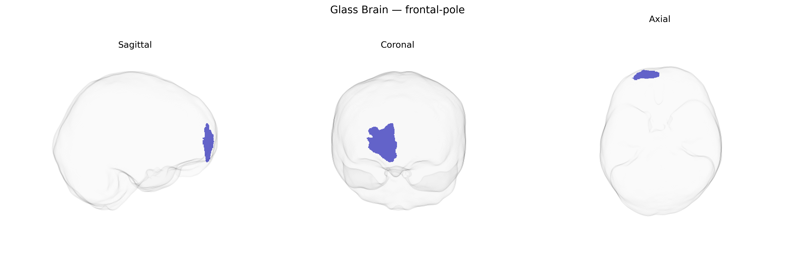

# frontal-pole

## Overview

The right frontal pole, corresponding roughly to the rostral/most anterior part of the right frontal lobe (often overlapping Brodmann area 10), is a high-level association region implicated in complex cognitive operations, such as prospective memory, multitasking, abstract reasoning, and integration of information over extended time scales. It participates in executive control and metacognitive processes, including evaluation of strategies and monitoring of one’s own performance, and is strongly interconnected with other prefrontal territories, limbic structures, and heteromodal association cortices. Functionally, the right frontal pole often shows engagement during tasks involving exploration of alternative behaviors, shifting between internal and external focus, and regulating responses in uncertain or novel situations, contributing to goal-directed behavior and flexible adaptation.

There is no direct Wikipedia link for “Right frontal-pole (brainCOLOR Atlas).” A closely related and encompassing structure is described here: https://en.wikipedia.org/wiki/Frontal_pole_cortex

*Overview generated by GPT-4o (2026).*

---

**Region ID:** 42  
**Hemisphere:** Right  
**Atlas:** brainCOLOR 

---

## frontal-pole – Black Background (Full Brain)

**Full Quality Version:** [Download MP4](full_black.mp4)

---

## frontal-pole – White Background (Full Brain)

**Full Quality Version:** [Download MP4](full_white.mp4)

---

## frontal-pole – Black Background (Hemisphere)

**Full Quality Version:** [Download MP4](hemi_black.mp4)

---

## frontal-pole – White Background (Hemisphere)

**Full Quality Version:** [Download MP4](hemi_white.mp4)

---

## Triplanar View – T1 Background

---

## Triplanar View – Ghost Brain


