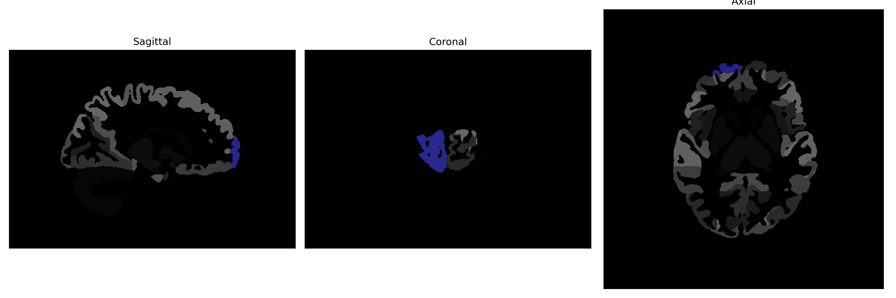

# frontal-pole

## Overview

The right frontal-pole brain region is situated at the most anterior part of the frontal lobes in the human brain. It plays a significant role in complex cognitive functions such as decision-making, social behavior, and managing emotional responses. The frontal pole is involved in high-level executive functions and is linked to strategic planning and abstract thinking, often coordinating with other regions for efficient processing and control of information. Neuroimaging studies have highlighted its involvement in a range of tasks that require attentional control, working memory, and the integration of emotional and cognitive processes. Due to its role in these high-order functions, the frontal pole is crucial for adaptive and goal-directed behavior. 

There is no direct Wikipedia link to the right frontal-pole brain region specifically within the brainCOLOR Atlas. However, the frontal lobe in general is discussed and can be accessed at this link: https://en.wikipedia.org/wiki/Frontal_lobe

*Overview generated by GPT-4o (2026).*

---

**Region ID:** 42  
**Hemisphere:** Right  
**Atlas:** brainCOLOR 

---

## Full Brain – Black Background

**Full Quality Version:** [Download MP4](full_black.mp4)

---

## Full Brain – White Background

**Full Quality Version:** [Download MP4](full_white.mp4)

---

## Hemisphere Only – Black Background

**Full Quality Version:** [Download MP4](hemi_black.mp4)

---

## Hemisphere Only – White Background

**Full Quality Version:** [Download MP4](hemi_white.mp4)

---

## Triplanar View (Centered on ROI)

