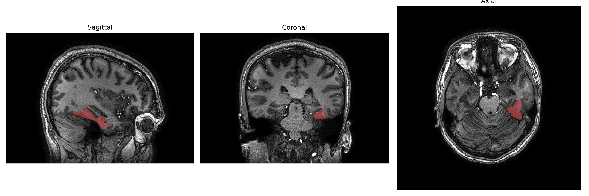
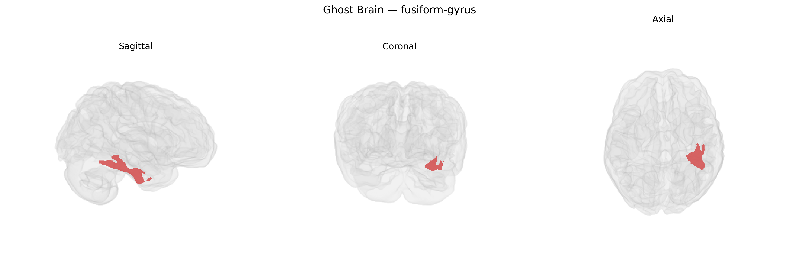

# fusiform-gyrus
 
## Overview
 
The Left fusiform gyrus is a ventral temporal lobe region located on the basal surface of the cerebral hemisphere, bounded medially by the collateral sulcus and laterally by the occipitotemporal sulcus, and extending from the posterior temporal to occipital regions. It participates in high-level visual processing, including object recognition, face perception, and, in the left hemisphere in particular, orthographic and word-form processing important for reading and language-related visual functions. Cytoarchitectonically, it encompasses parts of Brodmann areas 37 and 20, with dense reciprocal connections to visual association cortices, the inferior temporal cortex, and limbic structures such as the hippocampus. Functional imaging and lesion studies implicate the left fusiform gyrus in the visual word form area and show that damage can contribute to disorders such as pure alexia and category-specific recognition deficits. [Fusiform gyrus](https://en.wikipedia.org/wiki/Fusiform_gyrus)
 
The left fusiform gyrus, as defined in parcellations such as the brainCOLOR Atlas, shows genetic associations primarily related to reading, language, face processing, and neurodevelopmental and psychiatric traits. Twin and SNP-based heritability studies indicate moderate to high heritability of fusiform volume and surface area, with large-scale imaging-genetics consortia (e.g., ENIGMA, UK Biobank analyses) implicating variants in genes involved in neurodevelopment, synaptic function, and axon guidance (such as KIAA0586, WNT and MAPK pathway genes, and several loci near regulatory regions active in cortical development). GWAS of reading ability and dyslexia have linked variants near genes including DCDC2, KIAA0319, and ROBO1 to structural and functional differences in left fusiform regions overlapping the visual word form area, while studies of face perception and prosopagnosia have associated fusiform activation and morphology with variants in genes related to neuronal migration and synaptic plasticity, though specific robust loci are still emerging. In autism spectrum disorder and schizophrenia, polygenic risk scores and case-control imaging genetics consistently implicate the fusiform gyrus, where genetic risk burdens for social cognition and language-related pathways correlate with altered fusiform thickness, volume, or activation, and GWAS of cortical thickness/area have identified loci whose risk alleles are associated with fusiform morphological changes that partially overlap risk architectures for these disorders. Additionally, common variants influencing general cognitive ability and educational attainment show distributed effects on temporal and occipitotemporal cortices, including the left fusiform gyrus, suggesting that polygenic influences on cognition and language interact with development of this region’s specialized visual and orthographic functions.
 
*Overview generated by GPT-4o (2026).*
 
---
 
**Region ID:** 45  
**Hemisphere:** Left  
**Atlas:** brainCOLOR 
 
---
 
## fusiform-gyrus – Black Background (Full Brain)
 

 
**Full Quality Version:** <a href="full_black.mp4" download>Download MP4</a>
 
---
 
## fusiform-gyrus – White Background (Full Brain)
 

 
**Full Quality Version:** <a href="full_white.mp4" download>Download MP4</a>
 
---

## fusiform-gyrus – Black Background (Hemisphere)
 

 
**Full Quality Version:** <a href="hemi_black.mp4" download>Download MP4</a>
 
---
 
## fusiform-gyrus – White Background (Hemisphere)
 

 
**Full Quality Version:** <a href="hemi_white.mp4" download>Download MP4</a>
 
---

## Triplanar View – T1 Background
 

 
---
 
## Triplanar View – Ghost Brain
 


