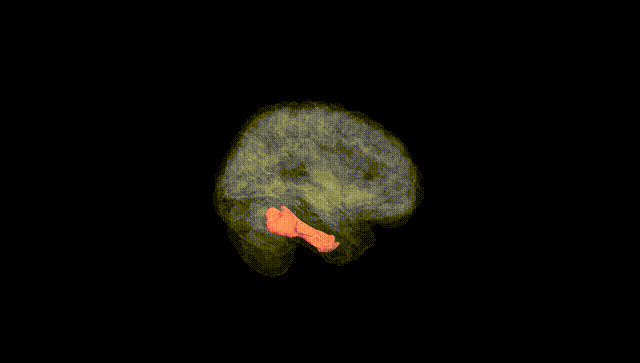
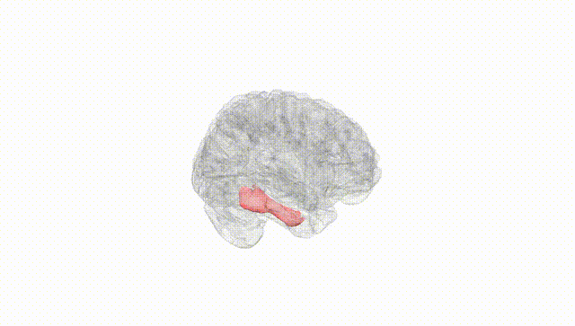
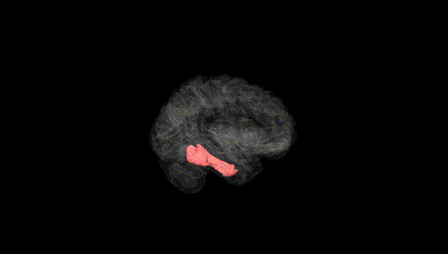
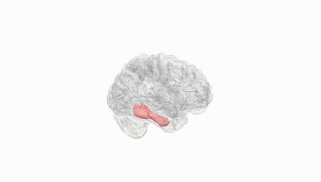
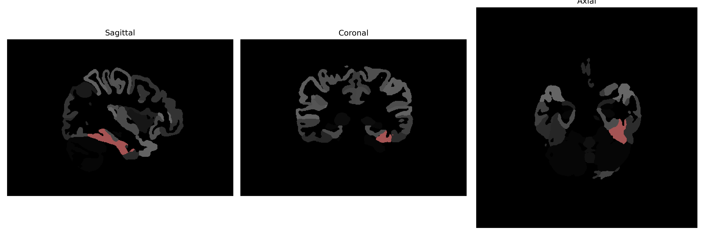

# fusiform-gyrus

## Overview

The left fusiform gyrus is located within the temporal lobe of the human brain and plays a critical role in high-level visual processing and recognition. It is part of the fusiform gyrus, which tends to be associated with the processing of complex visual stimuli such as faces, bodies, and words. Functionally, the left fusiform gyrus is involved in the visual word form system, contributing significantly to reading and language comprehension. It is also implicated in various cognitive processes that require the integration of visual and linguistic information. The region demonstrates rich connectivity with other parts of the brain, underscoring its importance in multiple neural networks.

There is no direct Wikipedia link specifically for the left fusiform gyrus description from the brainCOLOR Atlas, but more information about the broader fusiform gyrus can be found at: [https://en.wikipedia.org/wiki/Fusiform_gyrus](https://en.wikipedia.org/wiki/Fusiform_gyrus).

*Overview generated by GPT-4o (2026).*

---

**Region ID:** 45  
**Hemisphere:** Left  
**Atlas:** brainCOLOR 

---

## Full Brain – Black Background

**Full Quality Version:** [Download MP4](full_black.mp4)

---

## Full Brain – White Background

**Full Quality Version:** [Download MP4](full_white.mp4)

---

## Hemisphere Only – Black Background

**Full Quality Version:** [Download MP4](hemi_black.mp4)

---

## Hemisphere Only – White Background

**Full Quality Version:** [Download MP4](hemi_white.mp4)

---

## Triplanar View (Centered on ROI)

