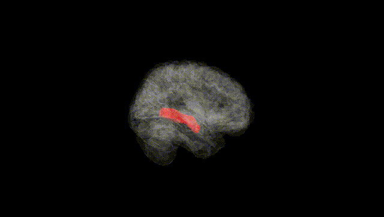
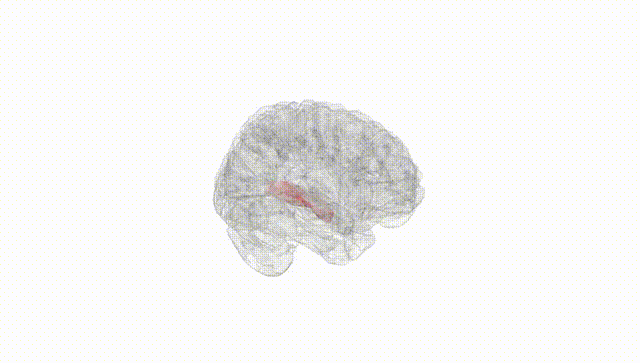
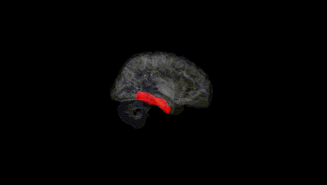
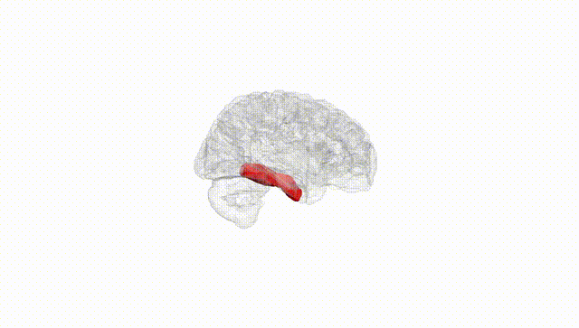
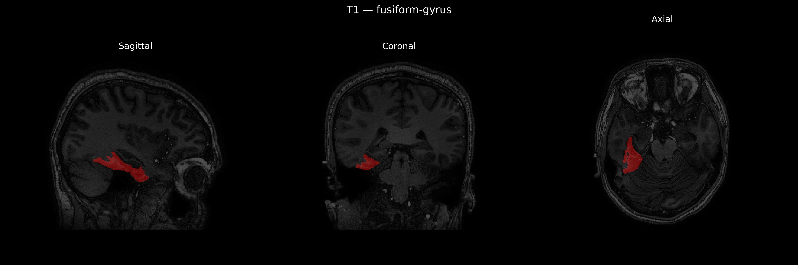
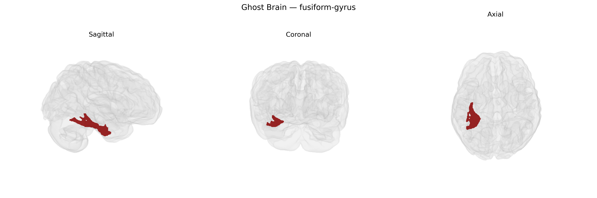

# fusiform-gyrus
 
## Overview
 
The Right fusiform gyrus, as defined in the brainCOLOR Atlas, is a ventral temporal lobe structure located on the basal surface of the right cerebral hemisphere, extending longitudinally between the inferior temporal gyrus laterally and the parahippocampal gyrus medially. It is supplied primarily by branches of the posterior cerebral artery and is cytoarchitectonically heterogeneous, encompassing regions associated with high-level visual processing, including face, word, and object recognition. Functionally, the right fusiform gyrus is especially implicated in face perception and individuation, often linked to the fusiform face area, and lesions in this region can result in deficits such as prosopagnosia. It plays a critical role in integrating complex visual information with memory and semantic systems, contributing to category-specific visual recognition and social cognition. [Fusiform gyrus](https://en.wikipedia.org/wiki/Fusiform_gyrus)
 
The right fusiform gyrus, as parcellated in the brainCOLOR atlas and related neuroimaging frameworks, has been implicated in several genetic and GWAS-based findings, particularly through imaging genetics studies of cortical thickness, surface area, and activation patterns. Large-scale consortia such as ENIGMA and UK Biobank–based GWAS have identified common variants influencing fusiform morphology, including loci near or within genes involved in neurodevelopment, synaptic function, and axon guidance (for example, variants near HMGA2, KIAA0586, and other neuronal development genes have been reported for temporal and occipitotemporal regions encompassing fusiform cortex, though not always lateralized). Polygenic risk for autism spectrum disorder and schizophrenia has been associated with structural and functional alterations in the right fusiform gyrus, consistent with its role in face processing and social cognition, while ADHD and major depressive disorder risk scores have shown weaker or more diffuse associations. GWAS of face recognition ability and prosopagnosia have identified heritable components and candidate loci that converge functionally on right fusiform “face area” circuitry, even when specific SNP–region links are not fully resolved. Additionally, Alzheimer’s disease and frontotemporal dementia risk variants have been linked to atrophy patterns that include the fusiform gyrus, with APOE ε4 status associated with fusiform cortical thinning in preclinical and clinical stages. Overall, genetic influences on the right fusiform gyrus appear highly polygenic and shared with broader temporal and occipitotemporal networks, with no single locus uniquely defining this region but multiple neurodevelopmental and neurodegeneration-related genes contributing to its structure and function.
 
*Overview generated by GPT-4o (2026).*
 
---
 
**Region ID:** 44  
**Hemisphere:** Right  
**Atlas:** brainCOLOR 
 
---
 
## fusiform-gyrus – Black Background (Full Brain)
 

 
**Full Quality Version:** <a href="full_black.mp4" download>Download MP4</a>
 
---
 
## fusiform-gyrus – White Background (Full Brain)
 

 
**Full Quality Version:** <a href="full_white.mp4" download>Download MP4</a>
 
---

## fusiform-gyrus – Black Background (Hemisphere)
 

 
**Full Quality Version:** <a href="hemi_black.mp4" download>Download MP4</a>
 
---
 
## fusiform-gyrus – White Background (Hemisphere)
 

 
**Full Quality Version:** <a href="hemi_white.mp4" download>Download MP4</a>
 
---

## Triplanar View – T1 Background
 

 
---
 
## Triplanar View – Ghost Brain
 


