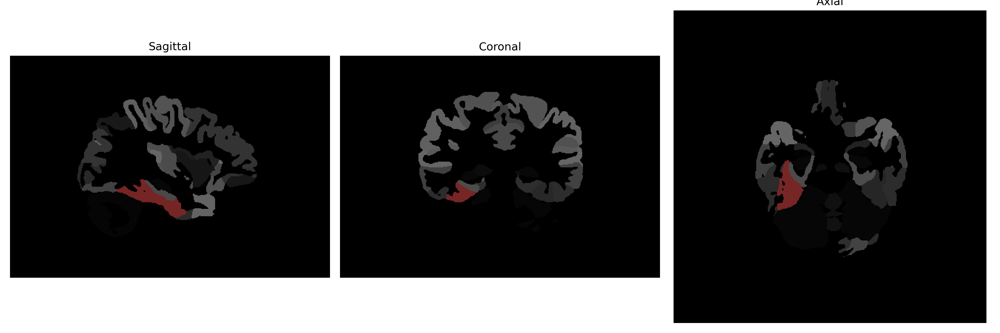

# fusiform-gyrus

## Overview

The right fusiform gyrus is part of the fusiform gyrus located in the temporal and occipital lobes of the brain, lying laterally to the inferior temporal gyrus and medially to the parahippocampal gyrus. It is primarily known for its role in high-level visual processing and recognition, particularly in the identification of faces, objects, and, to some extent, words. The fusiform gyrus, including its right hemisphere counterpart, is sometimes referred to as the "fusiform face area" due to its specialization in facial recognition. Functional imaging studies have often associated this region with processing categorical visual input and participating in a network of regions involved in visual object perception.

There is no direct Wikipedia link specifically for the "Right fusiform-gyrus" as detailed in the brainCOLOR Atlas. However, more information can be found on the general fusiform gyrus at: https://en.wikipedia.org/wiki/Fusiform_gyrus

*Overview generated by GPT-4o (2026).*

---

**Region ID:** 44  
**Hemisphere:** Right  
**Atlas:** brainCOLOR 

---

## Full Brain – Black Background

**Full Quality Version:** [Download MP4](full_black.mp4)

---

## Full Brain – White Background

**Full Quality Version:** [Download MP4](full_white.mp4)

---

## Hemisphere Only – Black Background

**Full Quality Version:** [Download MP4](hemi_black.mp4)

---

## Hemisphere Only – White Background

**Full Quality Version:** [Download MP4](hemi_white.mp4)

---

## Triplanar View (Centered on ROI)

