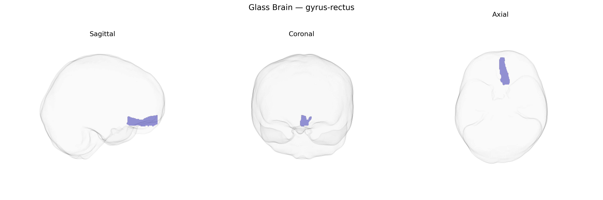

# gyrus-rectus

## Overview

The left gyrus rectus is the left-sided portion of the gyrus rectus (straight gyrus), a medial orbital frontal cortical region located on the inferior surface of the frontal lobe, adjacent to the olfactory sulcus and medial to the medial orbital gyrus. It is part of the orbitofrontal cortex and is supplied primarily by branches of the anterior cerebral artery. Although its precise functional specialization remains incompletely defined, it has been implicated in higher-order cognitive and affective processes, including aspects of reward evaluation, social and emotional behavior, and integration of visceral/autonomic information with decision-making. The left gyrus rectus, in particular, participates in hemispherically lateralized frontal networks that may contribute to language-related, executive, and emotional regulation functions, though these roles are typically studied at the level of broader medial and orbitofrontal cortices rather than this gyrus in isolation.

There is no direct Wikipedia link for “Left gyrus rectus” as a standalone entry; a related structure page is: https://en.wikipedia.org/wiki/Medial_frontal_gyrus

*Overview generated by GPT-4o (2026).*

---

**Region ID:** 47  
**Hemisphere:** Left  
**Atlas:** brainCOLOR 

---

## gyrus-rectus – Black Background (Full Brain)

**Full Quality Version:** [Download MP4](full_black.mp4)

---

## gyrus-rectus – White Background (Full Brain)

**Full Quality Version:** [Download MP4](full_white.mp4)

---

## gyrus-rectus – Black Background (Hemisphere)

**Full Quality Version:** [Download MP4](hemi_black.mp4)

---

## gyrus-rectus – White Background (Hemisphere)

**Full Quality Version:** [Download MP4](hemi_white.mp4)

---

## Triplanar View – T1 Background

---

## Triplanar View – Ghost Brain


