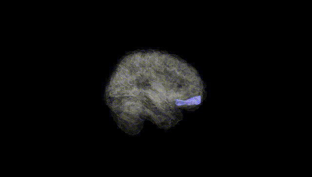
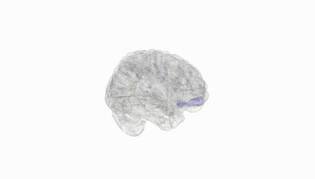
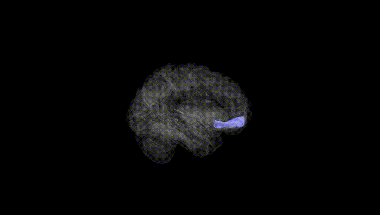
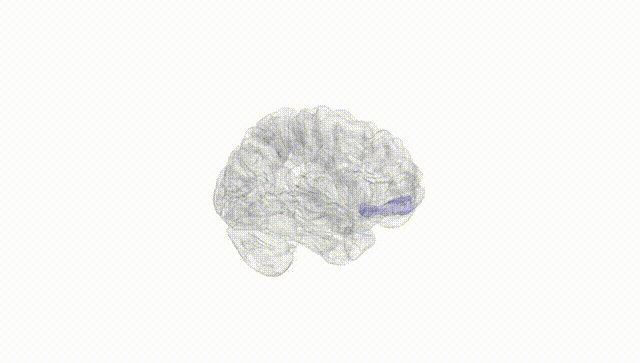
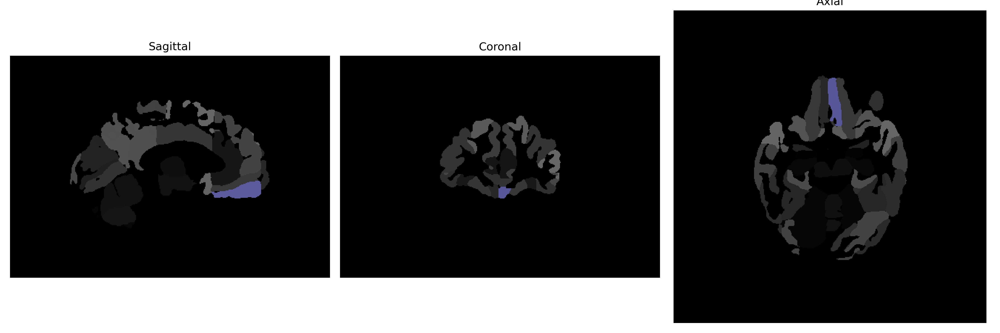

# gyrus-rectus

## Overview

The Left gyrus rectus, also known as the straight gyrus, is situated in the frontal lobe of the brain. It runs medially along the inferior surface of the frontal lobe, directly adjacent to the longitudinal fissure. This region is involved in various cognitive functions, including emotional processing and decision-making, as it has connections to other frontal areas and limbic structures. The gyrus rectus is notable for its role in integrating emotional and reward-related information. Microscopically, this area consists of granular cells and is part of the broader ventromedial prefrontal cortex, which is critical in social cognition and behavior regulation.

There is no direct Wikipedia link for the Left gyrus rectus. A related structure within which it is located is the frontal lobe. Here is a link to the frontal lobe on Wikipedia: https://en.wikipedia.org/wiki/Frontal_lobe.

*Overview generated by GPT-4o (2026).*

---

**Region ID:** 47  
**Hemisphere:** Left  
**Atlas:** brainCOLOR 

---

## Full Brain – Black Background

**Full Quality Version:** [Download MP4](full_black.mp4)

---

## Full Brain – White Background

**Full Quality Version:** [Download MP4](full_white.mp4)

---

## Hemisphere Only – Black Background

**Full Quality Version:** [Download MP4](hemi_black.mp4)

---

## Hemisphere Only – White Background

**Full Quality Version:** [Download MP4](hemi_white.mp4)

---

## Triplanar View (Centered on ROI)

