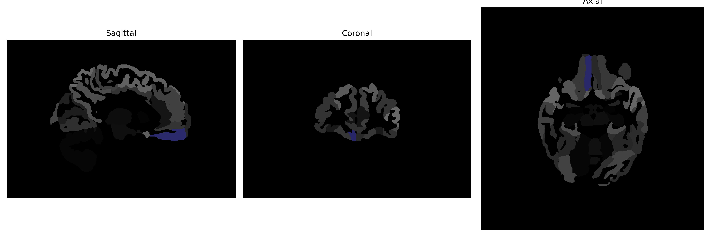

# gyrus-rectus

## Overview

The right gyrus rectus, part of the frontal lobe of the brain, is a strip of cortex located at the base of the prefrontal region, adjacent to the olfactory bulb. It plays a role in higher cognitive functions, including decision making and social behavior; its anatomical position suggests involvement in olfactory processing. This region is also sometimes associated with emotional regulation and personality expression due to its frontal lobe location. The gyrus rectus contributes to the complex interplay of neural networks that underlie behavior and cognition, displaying connections to various other brain regions essential for comprehensive neurological functioning.

There is no direct Wikipedia link to the right gyrus rectus. However, more information can be found on the frontal lobe, where the gyrus rectus is located: https://en.wikipedia.org/wiki/Frontal_lobe.

*Overview generated by GPT-4o (2026).*

---

**Region ID:** 46  
**Hemisphere:** Right  
**Atlas:** brainCOLOR 

---

## Full Brain – Black Background

**Full Quality Version:** [Download MP4](full_black.mp4)

---

## Full Brain – White Background

**Full Quality Version:** [Download MP4](full_white.mp4)

---

## Hemisphere Only – Black Background

**Full Quality Version:** [Download MP4](hemi_black.mp4)

---

## Hemisphere Only – White Background

**Full Quality Version:** [Download MP4](hemi_white.mp4)

---

## Triplanar View (Centered on ROI)

