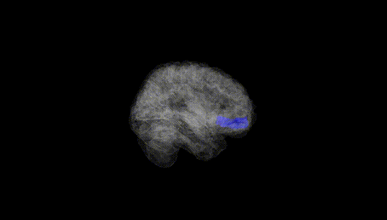
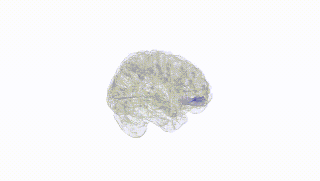
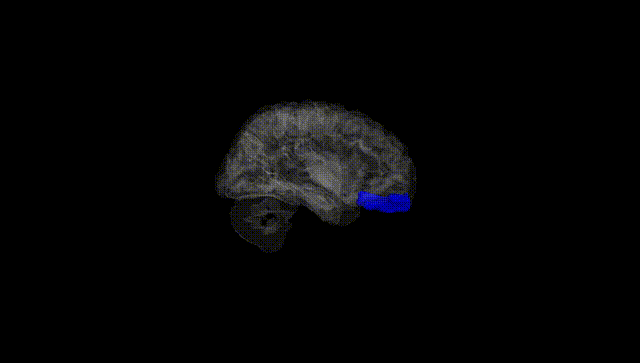
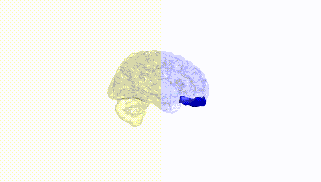
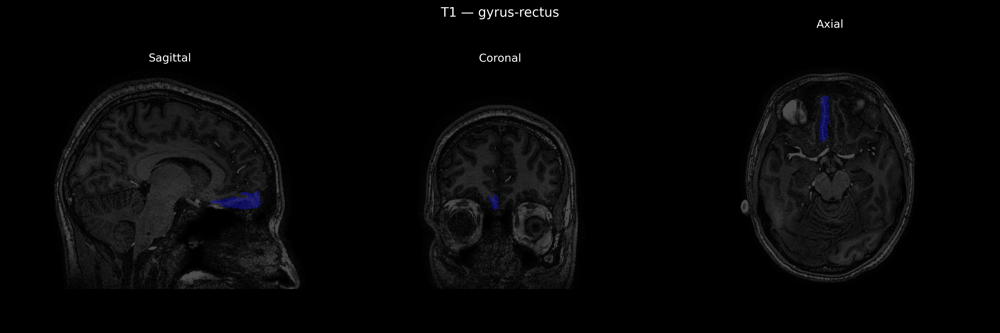
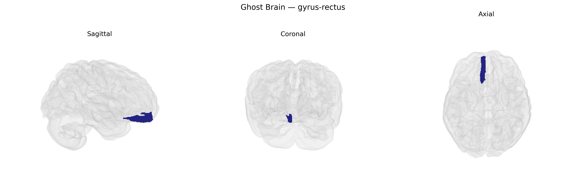

# gyrus-rectus
 
## Overview
 
The right gyrus rectus (right straight gyrus) is a medial orbital frontal lobe structure located on the inferior surface of the frontal lobe, bounded medially by the longitudinal fissure and laterally by the olfactory sulcus. It is cytoarchitectonically associated with parts of the orbitofrontal cortex and participates in higher-order integrative functions, including aspects of reward processing, decision-making, and emotional and social cognition, often through connections with limbic regions such as the amygdala and hippocampus. Although its specific function is less clearly delineated than other frontal regions, alterations in the gyrus rectus have been implicated in neuropsychiatric and neurodegenerative conditions, including depression, obsessive-compulsive disorder, and frontotemporal dementia. There is no direct link for “gyrus rectus,” but it is part of the [Orbitofrontal cortex](https://en.wikipedia.org/wiki/Orbitofrontal_cortex).
 
The right gyrus rectus (medial orbitofrontal/ventromedial prefrontal region, as defined in the brainCOLOR Atlas) has shown modest but convergent genetic associations in imaging and clinical GWAS, though findings are generally nonspecific and shared with broader orbitofrontal or frontal-lobe measures. Twin and SNP-heritability studies indicate that cortical thickness and surface area in the gyrus rectus are heritable, with polygenic influences overlapping those for general cognitive ability, educational attainment, and global brain volume. Large-scale imaging GWAS (e.g., UK Biobank–based analyses) have identified genome-wide significant loci influencing medial orbitofrontal/gyrus rectus morphology, including variants near genes involved in neurodevelopment, synaptic function, and axon guidance (such as those in or near DCC, MEF2C, and HMGA2), although these signals usually map to composite medial orbitofrontal regions rather than an isolated right gyrus rectus parcel. Clinically, structural or functional alterations encompassing the gyrus rectus have been implicated in mood and anxiety disorders, obsessive–compulsive disorder, and substance-use phenotypes; polygenic risk for major depressive disorder, schizophrenia, and bipolar disorder shows small but significant correlations with orbitofrontal morphometry that include the gyrus rectus. In neurodegenerative and neurodevelopmental conditions (e.g., frontotemporal dementia, Alzheimer’s disease, and autism spectrum disorder), risk variants and polygenic scores have been associated with medial orbitofrontal/gyrus rectus atrophy or connectivity changes, although no disorder-specific “gyrus rectus gene” has emerged. Overall, current evidence supports the right gyrus rectus as a genetically influenced component of a broader fronto-limbic network, with pleiotropic loci and polygenic liability contributing to its structure and function across multiple psychiatric, cognitive, and neurodegenerative traits, but with few findings uniquely confined to this precise atlas-defined region.
 
*Overview generated by GPT-4o (2026).*
 
---
 
**Region ID:** 46  
**Hemisphere:** Right  
**Atlas:** brainCOLOR 
 
---
 
## gyrus-rectus – Black Background (Full Brain)
 

 
**Full Quality Version:** <a href="full_black.mp4" download>Download MP4</a>
 
---
 
## gyrus-rectus – White Background (Full Brain)
 

 
**Full Quality Version:** <a href="full_white.mp4" download>Download MP4</a>
 
---

## gyrus-rectus – Black Background (Hemisphere)
 

 
**Full Quality Version:** <a href="hemi_black.mp4" download>Download MP4</a>
 
---
 
## gyrus-rectus – White Background (Hemisphere)
 

 
**Full Quality Version:** <a href="hemi_white.mp4" download>Download MP4</a>
 
---

## Triplanar View – T1 Background
 

 
---
 
## Triplanar View – Ghost Brain
 


