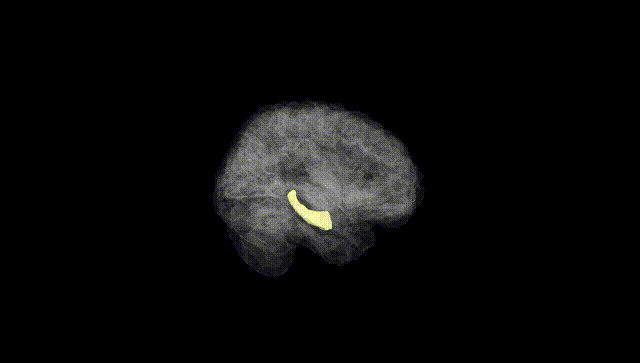
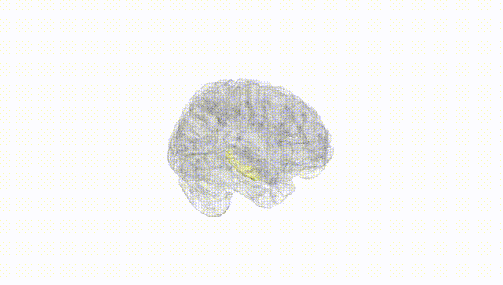
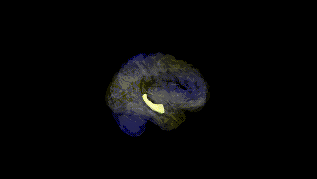
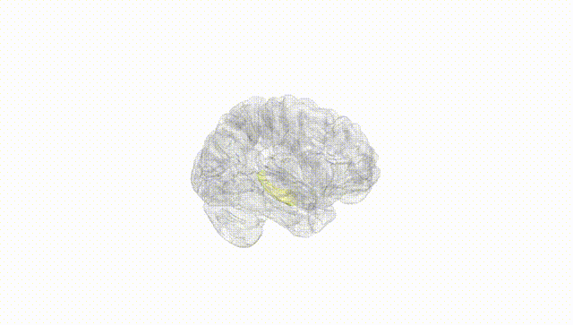
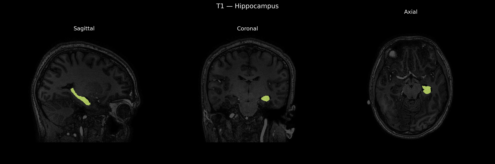
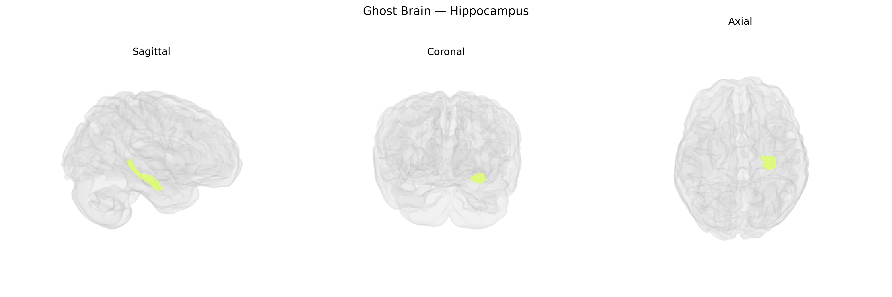

# Hippocampus

## Overview

The left hippocampus is a bilateral, curved, seahorse-shaped structure located in the medial temporal lobe, forming part of the hippocampal formation and the limbic system. It is composed of distinct subfields (CA1–CA4, dentate gyrus, and subiculum) with a well-defined trisynaptic circuit that supports synaptic plasticity and long-term potentiation. The left hippocampus is particularly associated with verbal and declarative memory, contextual learning, and the encoding and retrieval of episodic information, as well as spatial processing in conjunction with neocortical and subcortical networks. It receives multimodal sensory input via the entorhinal cortex and projects to widespread cortical and subcortical regions, including the prefrontal cortex, amygdala, and hypothalamus, thereby integrating memory, emotion, and executive functions. Structural and functional alterations in the left hippocampus are implicated in temporal lobe epilepsy, major depressive disorder, post-traumatic stress disorder, and neurodegenerative diseases such as Alzheimer’s disease. There is no direct Wikipedia link specific to the “Left Hippocampus” as a separate entry; a closely related and encompassing article is: https://en.wikipedia.org/wiki/Hippocampus.

*Overview generated by GPT-4o (2026).*

---

**Region ID:** 10  
**Hemisphere:** Left  
**Atlas:** brainCOLOR 

---

## Full Brain – Black Background

**Full Quality Version:** [Download MP4](full_black.mp4)

---

## Full Brain – White Background

**Full Quality Version:** [Download MP4](full_white.mp4)

---

## Hemisphere Only – Black Background

**Full Quality Version:** [Download MP4](hemi_black.mp4)

---

## Hemisphere Only – White Background

**Full Quality Version:** [Download MP4](hemi_white.mp4)

---

## Triplanar View – T1 Background

---

## Triplanar View – Ghost Brain


