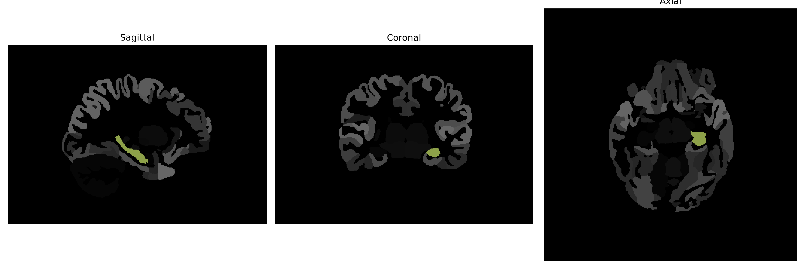

# Hippocampus

## Overview

The Left Hippocampus is part of the hippocampal formation, a critical structure within the medial temporal lobe of the brain, and is involved in the processes of memory formation, spatial navigation, and learning. It plays a significant role in consolidating information from short-term to long-term memory and in spatial memory that is necessary for navigation. The hippocampus is a bilateral structure, with two identical forms located on either side of the brain. Its anatomy features distinctive regions such as the dentate gyrus, CA1, CA2, CA3, and the subiculum, all of which contribute to its functions in memory processing. The Left Hippocampus is specifically linked to the encoding and retrieval of verbal information, given its proximity to language processing areas. Damage or dysfunction in this area can result in various cognitive deficits, including difficulties with new memory formation and orientation. 

There is no direct link to a Wikipedia article specifically for the Left Hippocampus; however, a related area can be found under the entry for the Hippocampus: [https://en.wikipedia.org/wiki/Hippocampus](https://en.wikipedia.org/wiki/Hippocampus).

*Overview generated by GPT-4o (2026).*

---

**Region ID:** 10  
**Hemisphere:** Left  
**Atlas:** brainCOLOR 

---

## Full Brain – Black Background

**Full Quality Version:** [Download MP4](full_black.mp4)

---

## Full Brain – White Background

**Full Quality Version:** [Download MP4](full_white.mp4)

---

## Hemisphere Only – Black Background

**Full Quality Version:** [Download MP4](hemi_black.mp4)

---

## Hemisphere Only – White Background

**Full Quality Version:** [Download MP4](hemi_white.mp4)

---

## Triplanar View (Centered on ROI)

