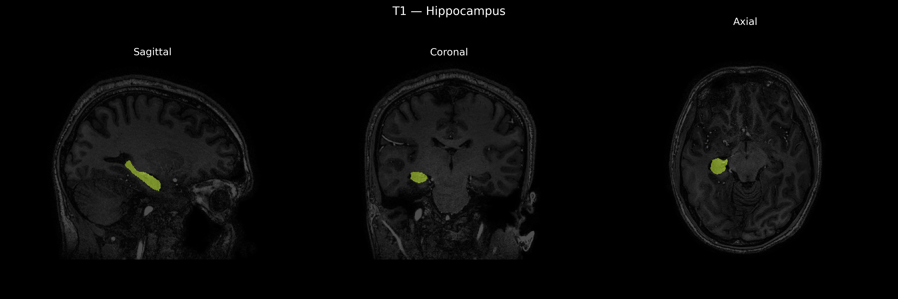
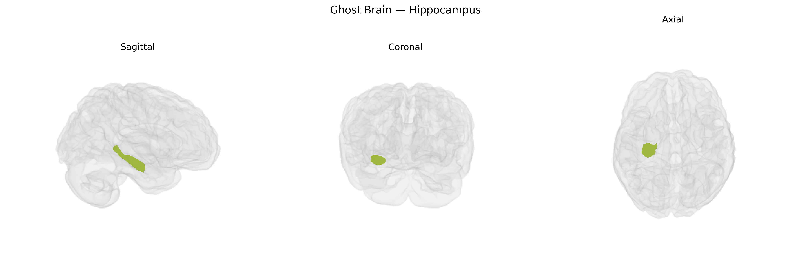

# Hippocampus

## Overview

The right hippocampus is a bilateral, seahorse-shaped structure located in the medial temporal lobe, forming part of the hippocampal formation along with the dentate gyrus and subiculum, and is a key component of the limbic system. It is composed of distinct subfields (CA1–CA4), each with characteristic cytoarchitecture and connectivity, and is heavily interconnected with the entorhinal cortex, parahippocampal regions, amygdala, and widespread cortical and subcortical areas. Functionally, the right hippocampus is particularly associated with spatial memory, navigation, and context-dependent memory processing, complementing the often more verbally oriented functions of the left hippocampus. It is critically involved in the consolidation of information from short-term to long-term memory and in forming relational representations of experience. The right hippocampus is highly vulnerable to hypoxia, ischemia, temporal lobe epilepsy, and neurodegenerative processes such as those seen in Alzheimer’s disease, with volumetric reductions frequently observed in these conditions. While there is no direct Wikipedia page for the “Right Hippocampus,” a closely related and encompassing structure is the hippocampus: https://en.wikipedia.org/wiki/Hippocampus.

*Overview generated by GPT-4o (2026).*

---

**Region ID:** 9  
**Hemisphere:** Right  
**Atlas:** brainCOLOR 

---

## Full Brain – Black Background

**Full Quality Version:** [Download MP4](full_black.mp4)

---

## Full Brain – White Background

**Full Quality Version:** [Download MP4](full_white.mp4)

---

## Hemisphere Only – Black Background

**Full Quality Version:** [Download MP4](hemi_black.mp4)

---

## Hemisphere Only – White Background

**Full Quality Version:** [Download MP4](hemi_white.mp4)

---

## Triplanar View – T1 Background

---

## Triplanar View – Ghost Brain


