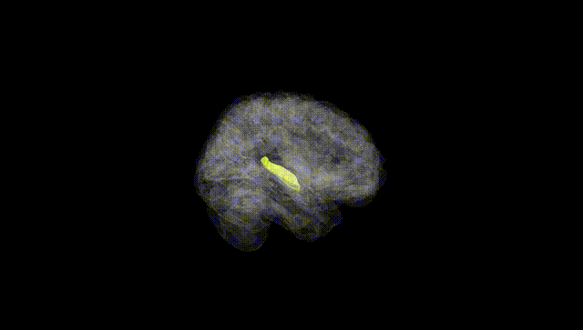
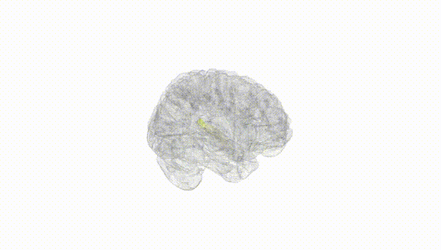
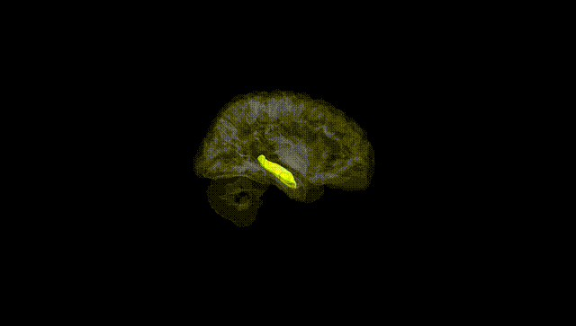
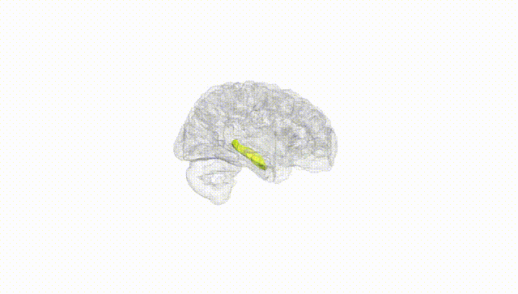
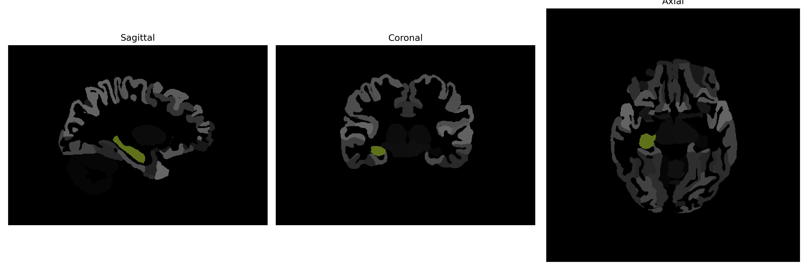

# Hippocampus

## Overview

The right hippocampus is a critical component of the human brain, located within the medial temporal lobe. It plays an essential role in memory formation, spatial navigation, and emotion regulation. Structurally, the hippocampus is part of the limbic system and is involved in converting short-term memories into long-term memories. It has a unique, seahorse-like shape, which is reflected in its name, derived from the Greek words "hippo" meaning horse and "kampos" meaning sea. The right hemisphere's hippocampus is particularly associated with spatial memory and navigation, which involves the ability to remember the spatial relationships between objects. It works in conjunction with the left hippocampus to ensure the cohesive functioning required for memory processes.

There is no direct link to a Wikipedia article explicitly dedicated to the right hippocampus as described in the brainCOLOR Atlas. However, a related article on the hippocampus can be found here: [Hippocampus - Wikipedia](https://en.wikipedia.org/wiki/Hippocampus).

*Overview generated by GPT-4o (2026).*

---

**Region ID:** 9  
**Hemisphere:** Right  
**Atlas:** brainCOLOR 

---

## Full Brain – Black Background

**Full Quality Version:** [Download MP4](full_black.mp4)

---

## Full Brain – White Background

**Full Quality Version:** [Download MP4](full_white.mp4)

---

## Hemisphere Only – Black Background

**Full Quality Version:** [Download MP4](hemi_black.mp4)

---

## Hemisphere Only – White Background

**Full Quality Version:** [Download MP4](hemi_white.mp4)

---

## Triplanar View (Centered on ROI)

