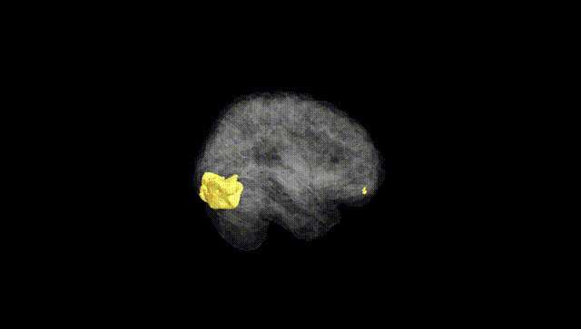
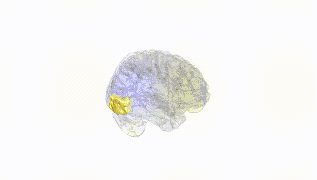
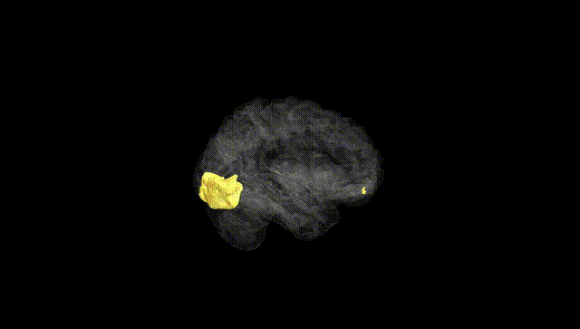
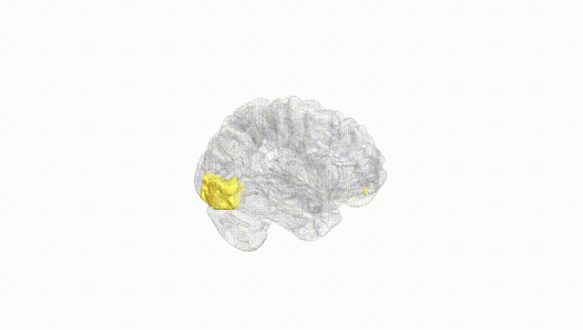
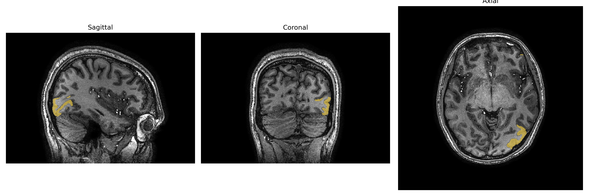
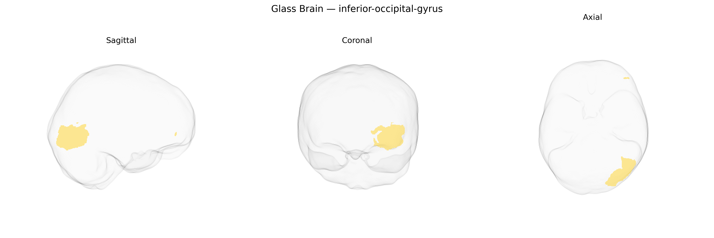

# inferior-occipital-gyrus

## Overview

The left inferior occipital gyrus is a ventral occipital cortical region situated along the inferior surface of the occipital lobe, bordered superiorly by the lateral occipital regions and extending toward the occipitotemporal (fusiform) cortex anteriorly. Cytoarchitectonically, it contains portions of visual association cortex that receive input from primary visual areas and participate in higher-order processing of visual features, including form, object, and potentially word-related visual information, with lateralization on the left often linked to language-related visual tasks (such as reading) and categorical object recognition. This region is interconnected with adjacent occipital and temporal visual areas, forming part of the ventral visual stream that underlies detailed object perception and visual identification. There is no direct Wikipedia page for the “left inferior occipital gyrus”; a related structure is described under the more general entry for the occipital lobe: https://en.wikipedia.org/wiki/Occipital_lobe.

*Overview generated by GPT-4o (2026).*

---

**Region ID:** 49  
**Hemisphere:** Left  
**Atlas:** brainCOLOR 

---

## inferior-occipital-gyrus – Black Background (Full Brain)

**Full Quality Version:** [Download MP4](full_black.mp4)

---

## inferior-occipital-gyrus – White Background (Full Brain)

**Full Quality Version:** [Download MP4](full_white.mp4)

---

## inferior-occipital-gyrus – Black Background (Hemisphere)

**Full Quality Version:** [Download MP4](hemi_black.mp4)

---

## inferior-occipital-gyrus – White Background (Hemisphere)

**Full Quality Version:** [Download MP4](hemi_white.mp4)

---

## Triplanar View – T1 Background

---

## Triplanar View – Ghost Brain


