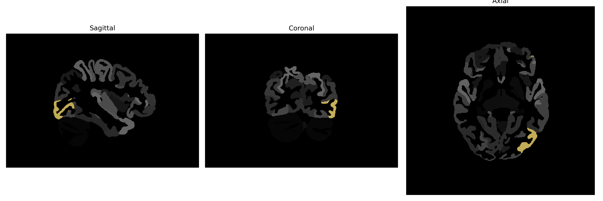

# inferior-occipital-gyrus

## Overview

The left inferior-occipital gyrus is a brain region located in the occipital lobe, which is primarily associated with visual processing. This region plays a key role in the perception and identification of visual stimuli, contributing to the processing of complex images and the recognition of objects and faces. Structurally, the gyrus is positioned in the lower part of the occipital lobe, adjacent to other important visual areas like the primary visual cortex. Neuroimaging studies often highlight the involvement of the inferior-occipital gyrus in the dorsal visual processing stream, which is crucial for the spatial and movement-related aspects of vision.

There is no direct Wikipedia link for the left inferior-occipital gyrus. However, a related link to the occipital lobe, where this gyrus resides, is: https://en.wikipedia.org/wiki/Occipital_lobe

*Overview generated by GPT-4o (2026).*

---

**Region ID:** 49  
**Hemisphere:** Left  
**Atlas:** brainCOLOR 

---

## Full Brain – Black Background

**Full Quality Version:** [Download MP4](full_black.mp4)

---

## Full Brain – White Background

**Full Quality Version:** [Download MP4](full_white.mp4)

---

## Hemisphere Only – Black Background

**Full Quality Version:** [Download MP4](hemi_black.mp4)

---

## Hemisphere Only – White Background

**Full Quality Version:** [Download MP4](hemi_white.mp4)

---

## Triplanar View (Centered on ROI)

