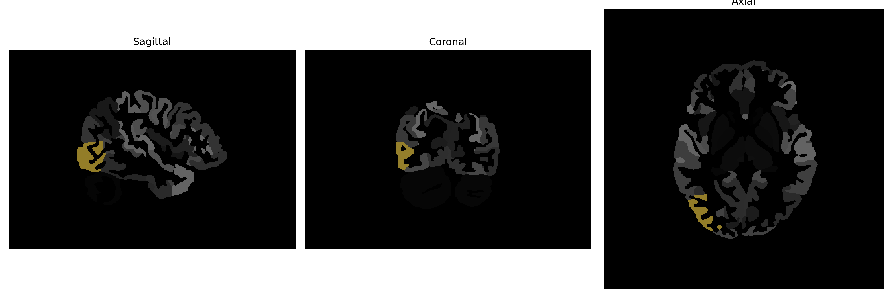

# inferior-occipital-gyrus

## Overview

The right inferior occipital gyrus is a part of the occipital lobe in the human brain, located on the lower part of the occipital cortex. It plays a crucial role in visual processing and is involved in the early stages of the visual perception pathway, including the recognition and interpretation of complex visual stimuli such as shapes and faces. This region is interconnected with both the dorsal and ventral streams of vision, facilitating the integration of visual information from diverse sensory inputs. Anatomically distinct, the right inferior occipital gyrus contributes to various higher-order cognitive functions related to vision and spatial awareness.

There is no direct Wikipedia link specifically for the right inferior occipital gyrus, but more information can be found about its general location and function within the occipital lobe: [Occipital lobe - Wikipedia](https://en.wikipedia.org/wiki/Occipital_lobe).

*Overview generated by GPT-4o (2026).*

---

**Region ID:** 48  
**Hemisphere:** Right  
**Atlas:** brainCOLOR 

---

## Full Brain – Black Background

**Full Quality Version:** [Download MP4](full_black.mp4)

---

## Full Brain – White Background

**Full Quality Version:** [Download MP4](full_white.mp4)

---

## Hemisphere Only – Black Background

**Full Quality Version:** [Download MP4](hemi_black.mp4)

---

## Hemisphere Only – White Background

**Full Quality Version:** [Download MP4](hemi_white.mp4)

---

## Triplanar View (Centered on ROI)

