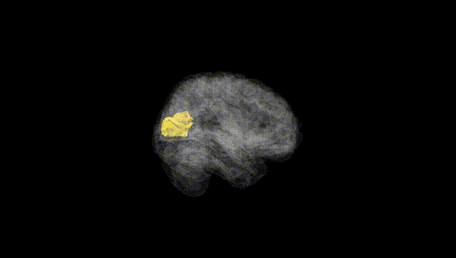
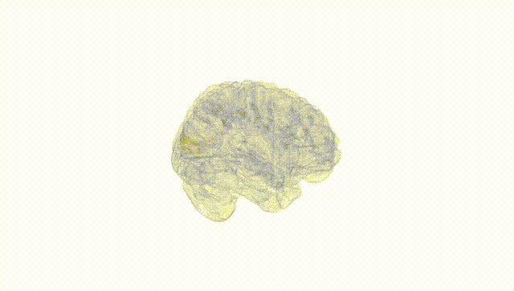
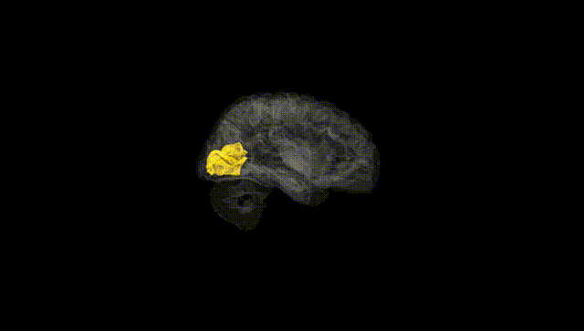
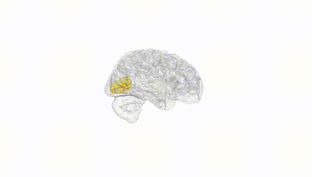
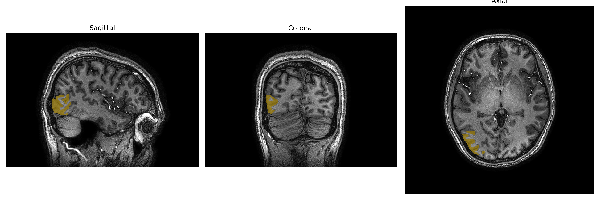
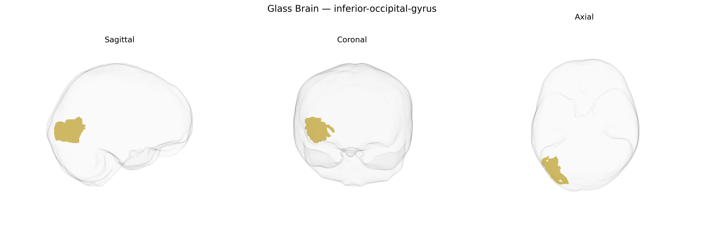

# inferior-occipital-gyrus

## Overview

The right inferior occipital gyrus is a ventral occipital cortical region located on the underside of the occipital lobe, lateral to the lingual gyrus and medial/inferior to the lateral occipital cortex, and it forms part of the early and intermediate stages of the ventral visual processing stream. It is primarily involved in visual feature analysis, including processing of shape, edges, and object-related details that contribute to higher-order form and object recognition in more anterior ventral temporal regions. This gyrus receives input from early visual areas and is interconnected with adjacent occipital and occipito-temporal regions, supporting integration of low-level visual information into more complex perceptual representations. Functionally, it participates in tasks involving object perception and categorization, and lesions or dysfunction in this area can contribute to deficits in visual recognition, such as aspects of apperceptive agnosia. There is no direct Wikipedia page specifically for the “right inferior occipital gyrus”; a closely related and encompassing structure is the occipital lobe: https://en.wikipedia.org/wiki/Occipital_lobe

*Overview generated by GPT-4o (2026).*

---

**Region ID:** 48  
**Hemisphere:** Right  
**Atlas:** brainCOLOR 

---

## inferior-occipital-gyrus – Black Background (Full Brain)

**Full Quality Version:** [Download MP4](full_black.mp4)

---

## inferior-occipital-gyrus – White Background (Full Brain)

**Full Quality Version:** [Download MP4](full_white.mp4)

---

## inferior-occipital-gyrus – Black Background (Hemisphere)

**Full Quality Version:** [Download MP4](hemi_black.mp4)

---

## inferior-occipital-gyrus – White Background (Hemisphere)

**Full Quality Version:** [Download MP4](hemi_white.mp4)

---

## Triplanar View – T1 Background

---

## Triplanar View – Ghost Brain


