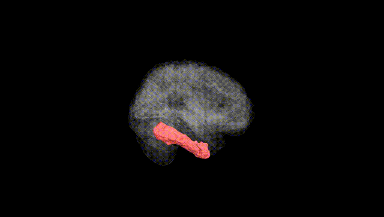
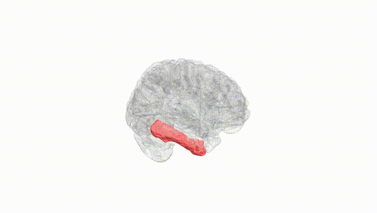
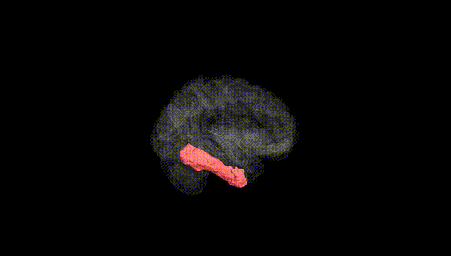
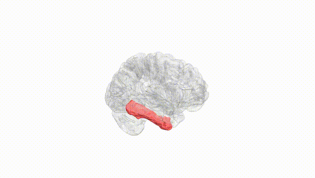
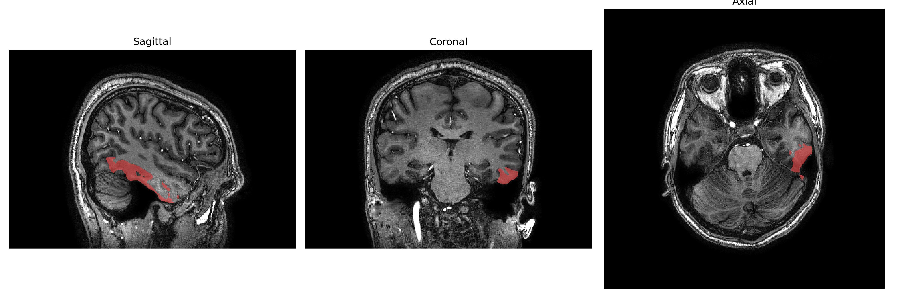
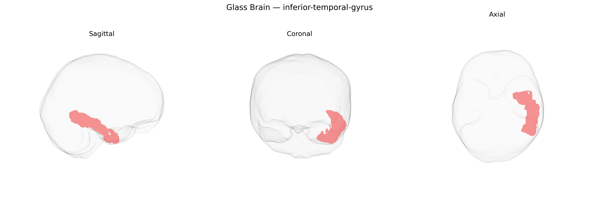

# inferior-temporal-gyrus

## Overview

The left inferior temporal gyrus is a ventrolateral cortical region of the temporal lobe, located on the basal and lateral surface between the middle temporal gyrus dorsally and the fusiform gyrus ventrally, extending from the temporal pole anteriorly toward the occipital lobe posteriorly. Cytoarchitectonically, it comprises higher-order association cortex involved in complex visual object processing, including shape and category recognition, and contributes to semantic processing and aspects of visual language functions, particularly in the dominant (typically left) hemisphere. It receives convergent input from earlier visual areas in the occipital and temporal lobes and projects to widespread temporal and frontal association areas, integrating visual features into coherent object representations that can be linked to stored conceptual and lexical information. The left inferior temporal gyrus is also implicated in category-specific deficits and visual agnosias when lesioned, and participates in distributed networks underlying reading, naming, and recognition of meaningful visual stimuli.

No direct Wikipedia page exists for the “left inferior temporal gyrus”; a related structure is the inferior temporal gyrus: https://en.wikipedia.org/wiki/Inferior_temporal_gyrus

*Overview generated by GPT-4o (2026).*

---

**Region ID:** 51  
**Hemisphere:** Left  
**Atlas:** brainCOLOR 

---

## inferior-temporal-gyrus – Black Background (Full Brain)

**Full Quality Version:** [Download MP4](full_black.mp4)

---

## inferior-temporal-gyrus – White Background (Full Brain)

**Full Quality Version:** [Download MP4](full_white.mp4)

---

## inferior-temporal-gyrus – Black Background (Hemisphere)

**Full Quality Version:** [Download MP4](hemi_black.mp4)

---

## inferior-temporal-gyrus – White Background (Hemisphere)

**Full Quality Version:** [Download MP4](hemi_white.mp4)

---

## Triplanar View – T1 Background

---

## Triplanar View – Ghost Brain


