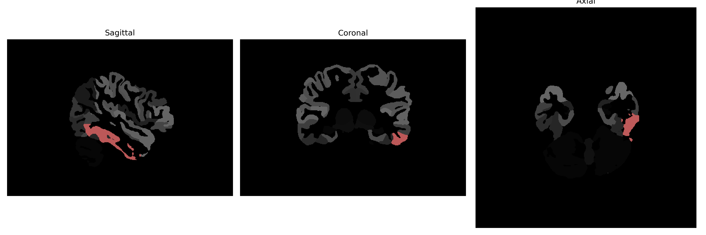

# inferior-temporal-gyrus

## Overview

The Left Inferior Temporal Gyrus is part of the temporal lobe located on the ventral surface of the brain. This gyrus plays a crucial role in visual processing, particularly in the recognition and identification of objects and complex stimuli, including faces. The temporal gyrus is richly interconnected with other areas of the brain, such as the occipital lobe, which enables it to contribute to the integration of visual information. Its functioning is also associated with semantic memory and language comprehension, as it interfaces with various networks involved in the processing of meaning derived from visual and linguistic inputs.

There is no direct Wikipedia link for the Left Inferior Temporal Gyrus specifically. However, additional information about its function and connections can be found on the Wikipedia page for the Temporal Lobe: https://en.wikipedia.org/wiki/Temporal_lobe.

*Overview generated by GPT-4o (2026).*

---

**Region ID:** 51  
**Hemisphere:** Left  
**Atlas:** brainCOLOR 

---

## Full Brain – Black Background

**Full Quality Version:** [Download MP4](full_black.mp4)

---

## Full Brain – White Background

**Full Quality Version:** [Download MP4](full_white.mp4)

---

## Hemisphere Only – Black Background

**Full Quality Version:** [Download MP4](hemi_black.mp4)

---

## Hemisphere Only – White Background

**Full Quality Version:** [Download MP4](hemi_white.mp4)

---

## Triplanar View (Centered on ROI)

