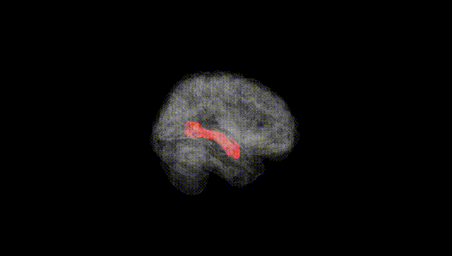
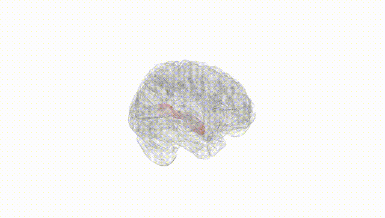
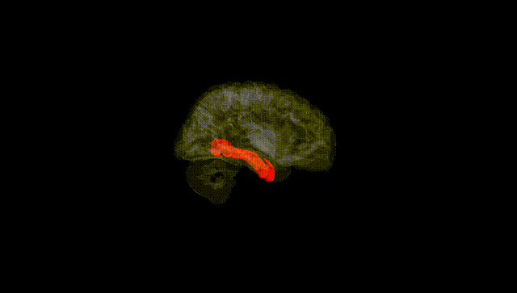
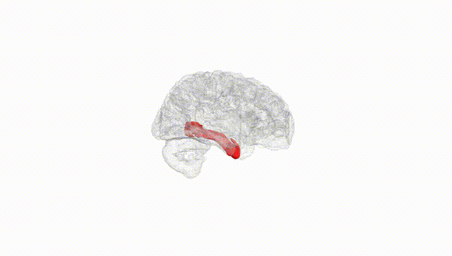
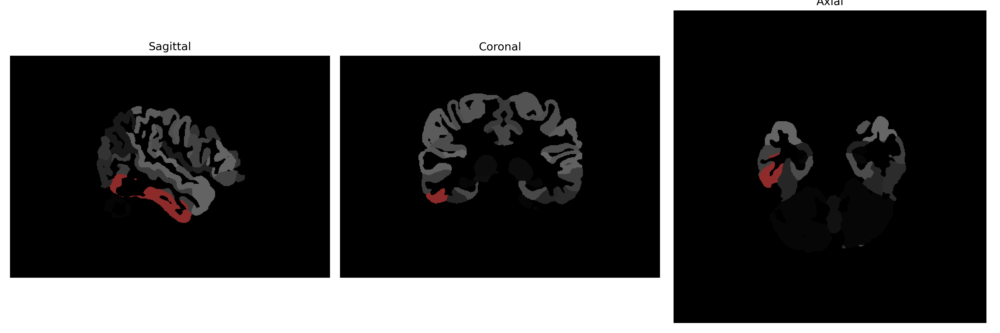

# inferior-temporal-gyrus

## Overview

The Right Inferior Temporal Gyrus is a region located within the temporal lobe of the brain and plays a critical role in various aspects of visual processing, including object recognition and facial perception. This brain area exhibits a complex architecture supportive of higher-order cognitive processes and is interconnected with other regions involved in memory and language. The right hemisphere localizations suggest an emphasis on visuospatial processing, contributing to the intricate network of information integration necessary for comprehensive perceptual understanding. The Inferior Temporal Gyrus's functions are vital for effective interaction with the environment, interpreting visual stimuli into recognizable patterns and entities.

There is no direct Wikipedia link for just the Right Inferior Temporal Gyrus, but more general information can be found about the temporal lobe: https://en.wikipedia.org/wiki/Temporal_lobe

*Overview generated by GPT-4o (2026).*

---

**Region ID:** 50  
**Hemisphere:** Right  
**Atlas:** brainCOLOR 

---

## Full Brain – Black Background

**Full Quality Version:** [Download MP4](full_black.mp4)

---

## Full Brain – White Background

**Full Quality Version:** [Download MP4](full_white.mp4)

---

## Hemisphere Only – Black Background

**Full Quality Version:** [Download MP4](hemi_black.mp4)

---

## Hemisphere Only – White Background

**Full Quality Version:** [Download MP4](hemi_white.mp4)

---

## Triplanar View (Centered on ROI)

