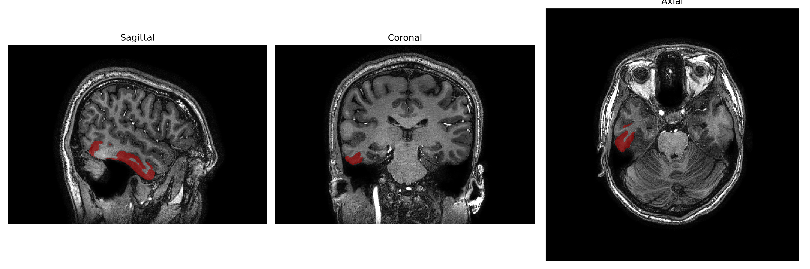
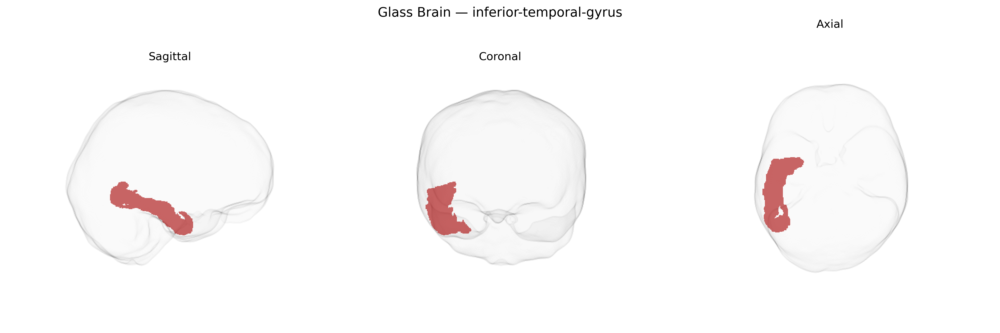

# inferior-temporal-gyrus

## Overview

The right inferior temporal gyrus (ITG) is a ventral temporal lobe cortical region situated on the lateral and inferior surface of the right hemisphere, bordered superiorly by the middle temporal gyrus and inferiorly by the occipitotemporal (fusiform) gyrus, extending from the temporal pole posteriorly toward the occipital lobe. It is part of the ventral visual stream and is critically involved in high-level visual processing, including object recognition, complex shape and form analysis, and integration of visual features into coherent representations. The right ITG, in particular, has been associated with aspects of visual object memory, face- and body-related processing in coordination with neighboring fusiform and occipital regions, and the semantic categorization of visual stimuli. It receives convergent input from earlier visual areas and projects to multimodal and associative regions, supporting the transformation of visual percepts into meaningful, behaviorally relevant information. There is no direct Wikipedia page for the “Right inferior temporal gyrus” as a separate entry; a related and encompassing structure is the inferior temporal gyrus: https://en.wikipedia.org/wiki/Inferior_temporal_gyrus

*Overview generated by GPT-4o (2026).*

---

**Region ID:** 50  
**Hemisphere:** Right  
**Atlas:** brainCOLOR 

---

## inferior-temporal-gyrus – Black Background (Full Brain)

**Full Quality Version:** [Download MP4](full_black.mp4)

---

## inferior-temporal-gyrus – White Background (Full Brain)

**Full Quality Version:** [Download MP4](full_white.mp4)

---

## inferior-temporal-gyrus – Black Background (Hemisphere)

**Full Quality Version:** [Download MP4](hemi_black.mp4)

---

## inferior-temporal-gyrus – White Background (Hemisphere)

**Full Quality Version:** [Download MP4](hemi_white.mp4)

---

## Triplanar View – T1 Background

---

## Triplanar View – Ghost Brain


