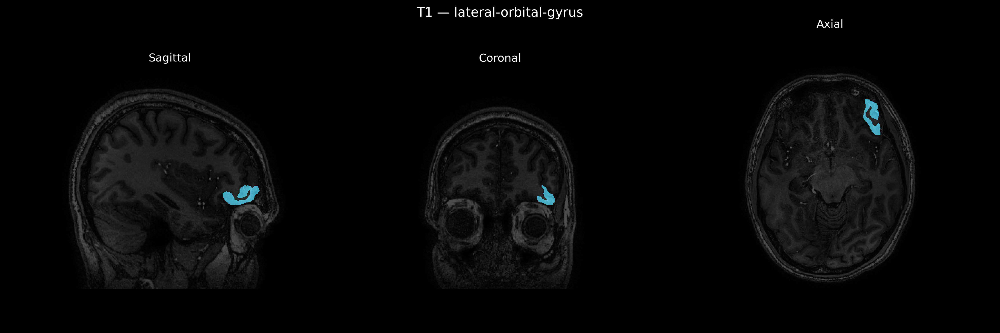
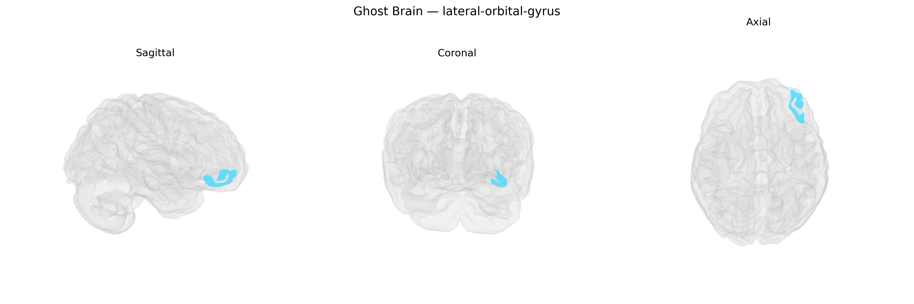

# lateral-orbital-gyrus

## Overview

The left lateral orbital gyrus is a cortical region on the ventrolateral surface of the frontal lobe, forming part of the orbitofrontal cortex and lying directly above the orbits. In the brainCOLOR Atlas, it is delineated as a distinct gyral subdivision lateral to the medial and anterior orbital gyri, bounded superiorly by the inferior frontal gyrus and inferiorly by the orbital sulci that separate it from adjacent orbital fields. Cytoarchitectonically, it corresponds largely to portions of Brodmann areas 11 and 47, and it participates in networks involved in reward valuation, decision-making, affect regulation, and the integration of sensory and visceral information to guide behavior. A direct Wikipedia page for the “left lateral-orbital-gyrus” as a brainCOLOR-defined region does not exist; a closely related and encompassing structure is the orbitofrontal cortex: https://en.wikipedia.org/wiki/Orbitofrontal_cortex.

*Overview generated by GPT-4o (2026).*

---

**Region ID:** 55  
**Hemisphere:** Left  
**Atlas:** brainCOLOR 

---

## Full Brain – Black Background

**Full Quality Version:** [Download MP4](full_black.mp4)

---

## Full Brain – White Background

**Full Quality Version:** [Download MP4](full_white.mp4)

---

## Hemisphere Only – Black Background

**Full Quality Version:** [Download MP4](hemi_black.mp4)

---

## Hemisphere Only – White Background

**Full Quality Version:** [Download MP4](hemi_white.mp4)

---

## Triplanar View – T1 Background

---

## Triplanar View – Ghost Brain


