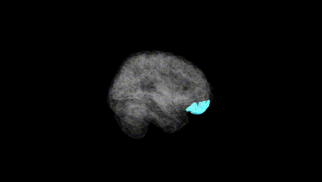
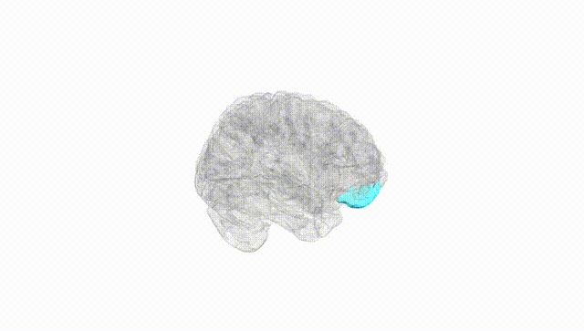
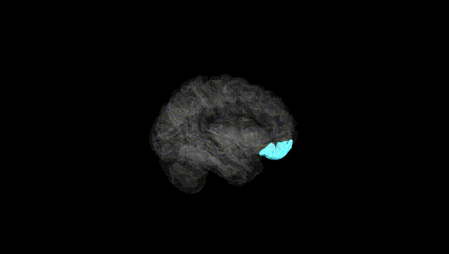
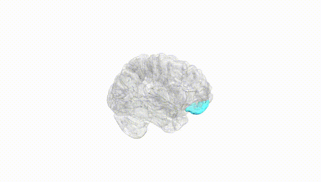
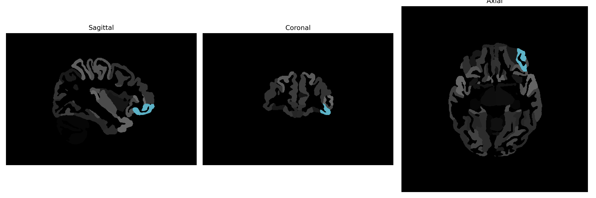

# lateral-orbital-gyrus

## Overview

The left lateral-orbital gyrus is a region of the brain located in the frontal lobe. It is part of the orbitofrontal cortex, which is situated above the orbits (eye sockets) and is associated with cognitive processing and decision-making. This region is involved in evaluating rewards, emotional responses, and social behavior, integrating sensory inputs to guide behavior and decision-making processes. The lateral positioning of this gyrus suggests it may play a part in processing complex stimuli and making adjustments based on appropriate feedback. It collaborates with other brain regions to process information that influences actions and responses. 

There is no direct Wikipedia link for the Left lateral-orbital-gyrus from the brainCOLOR Atlas. A related area would be the "orbitofrontal cortex": https://en.wikipedia.org/wiki/Orbitofrontal_cortex.

*Overview generated by GPT-4o (2026).*

---

**Region ID:** 55  
**Hemisphere:** Left  
**Atlas:** brainCOLOR 

---

## Full Brain – Black Background

**Full Quality Version:** [Download MP4](full_black.mp4)

---

## Full Brain – White Background

**Full Quality Version:** [Download MP4](full_white.mp4)

---

## Hemisphere Only – Black Background

**Full Quality Version:** [Download MP4](hemi_black.mp4)

---

## Hemisphere Only – White Background

**Full Quality Version:** [Download MP4](hemi_white.mp4)

---

## Triplanar View (Centered on ROI)

