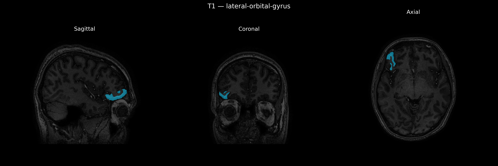
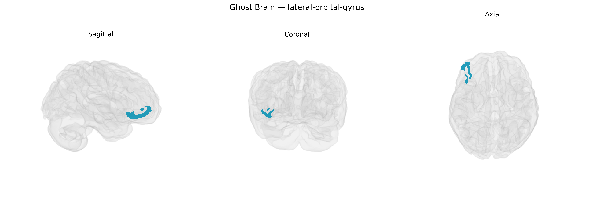

# lateral-orbital-gyrus

## Overview

The right lateral orbital gyrus is a cortical region on the ventrolateral surface of the frontal lobe, forming part of the orbitofrontal cortex overlying the lateral orbital surface of the frontal pole and inferior frontal gyrus. It is located superior to the orbital part of the inferior frontal gyrus and lateral to the medial and posterior orbital gyri, separated from them by shallow orbital sulci. Cytoarchitectonically, it corresponds largely to lateral orbitofrontal areas (e.g., Brodmann area 47/12 in primates) involved in integrating multisensory information with reward- and punishment-related signals. Functionally, the right lateral orbital gyrus participates in value-based decision making, reversal learning, outcome evaluation, social and emotional processing, and the modulation of autonomic responses to affective stimuli, with clinical relevance in mood disorders, obsessive–compulsive disorder, addiction, and frontal lobe injury.  

No direct Wikipedia article exists for the “right lateral orbital gyrus”; a closely related and encompassing structure is the orbitofrontal cortex:  
https://en.wikipedia.org/wiki/Orbitofrontal_cortex

*Overview generated by GPT-4o (2026).*

---

**Region ID:** 54  
**Hemisphere:** Right  
**Atlas:** brainCOLOR 

---

## Full Brain – Black Background

**Full Quality Version:** [Download MP4](full_black.mp4)

---

## Full Brain – White Background

**Full Quality Version:** [Download MP4](full_white.mp4)

---

## Hemisphere Only – Black Background

**Full Quality Version:** [Download MP4](hemi_black.mp4)

---

## Hemisphere Only – White Background

**Full Quality Version:** [Download MP4](hemi_white.mp4)

---

## Triplanar View – T1 Background

---

## Triplanar View – Ghost Brain


